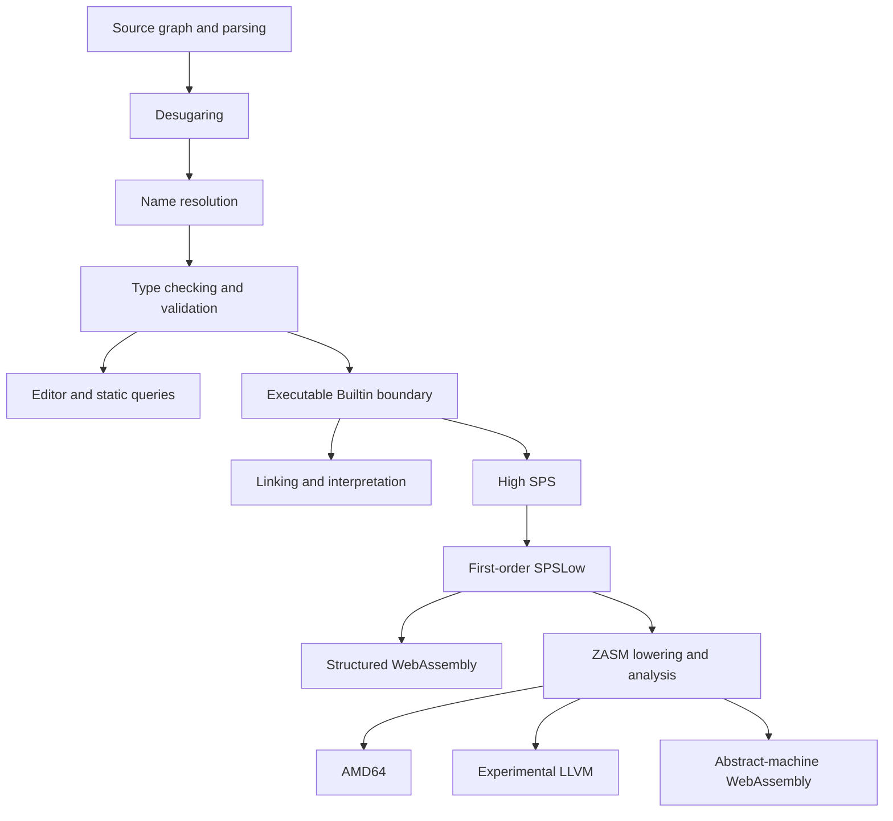

# Design

Zydeco is a proof-of-concept language for studying call-by-push-value (CBPV),
stack-manipulating computation, and relative monads.
This document describes the current language and implementation boundaries.
The linked proposals explain individual mechanisms and their rationale;
[CONTRIBUTING.md](CONTRIBUTING.md) covers tooling,
and the [language guide](docs/tutorial/zydeco-guide.md) provides a longer source-level walkthrough.

## Language Model

Zydeco separates values from computations.
Values include variables, thunks, units, products, constructors, literals, and total value functions.
Computations may perform effects and include forcing thunks, computation-function application,
do-bindings, and returning values.

`VType` classifies value types and `CType` classifies computation types.
The boundary constructors are `Thk B`, which suspends a computation as a value,
and `Ret A`, which classifies a computation returning an `A`.
Kinds are classified by the meta-level `Set`, which has no source term form.

A checked source can be a kind, type, value, or computation.
The CLI's `run` and `build` commands impose an additional entry boundary:
the root must accept the Builtin package and end in that package's `OS` computation protocol.
For example, `ret 1` is a valid checked term and can be evaluated in the REPL, but is not a standalone CLI executable.
[README.md](README.md#quick-start) shows the complete executable form.

### Computation Types as Stack Protocols

A value type classifies inert data; a computation type classifies a continuation stack.
Read `M : B` as saying that `M` can consume a stack with protocol `B`, not that it produces a value of type `B`.
`Ret A` expects a return continuation accepting an `A`; `A -> B` expects an `A` argument above a residual `B` stack;
codata describes alternatives of observable frames.

Stack shape is a typed control protocol, not a physical layout: native code may use the machine stack,
while WebAssembly may use explicit frames and a trampoline.
`Thk B` is suspended code compatible with a `B` stack, not the stack itself.

`OS` is the root protocol. An `OS`-typed computation consumes the process stack prepared
by the operating system and adapted by the launcher and runtime.
It has no ordinary source-level return: it transfers control to another `OS` computation,
terminates, aborts, or diverges.
Here, *consume* describes control flow, not linearity or destructive stack mutation.

The host interface illustrates the resulting control convention:

```text
write : Thk (String -> Thk OS -> OS)
exit  : Thk (Int64 -> OS)
```

`write` receives an explicit `Thk OS` successor, whereas `exit` terminates.
The successor is suspended code, not automatically a captured machine stack.
An FFI must therefore return an `A` for `Ret A`, but select a successor or terminate for `OS`.

The [returning C import proposal](docs/proposals/c-ffi.md) specifies the initial classifier-to-ABI mapping,
its borrowed-buffer contract, and the call plan shared by the interpreter and native backend.

## Source Terms and Imports

Every Zydeco source file contains exactly one complete term.
A file contributes no surrounding context: all names are bound by forms in the term itself.
In particular, `param` and `param val` are ordinary term forms that construct abstractions;
they do not declare file parameters.

After its own imports and optional companion annotation have been assembled,
a source root is resolved and type checked under an empty context and must synthesize its classifier.
An expected classifier at an import site may be compared with that result, but it does not participate
in elaborating the imported source.

Imports are typed metadata on holes, such as `@[import("library.zy")] _`.
Parenthesized metadata `@(meta)` abbreviates the bracket form whose payload is a hole,
so `@(import("library.zy"))` names the same import.
A compiler session discovers the file dependency graph, orders providers before their consumers,
and materializes each provider as one shared term node.
The provider is resolved and checked once under its own empty context;
every import occurrence is an edge to that checked root.
A source boundary prevents free names and mobile block bindings from crossing between the two terms.
Sharing is static: an imported computation is still evaluated at every dynamic occurrence.

An implementation source `foo.zy` may have an adjacent companion `foo.zyi`.
The companion contains one ordinary type term and must itself synthesize a type.
Source assembly treats the pair as the annotated term `(contents-of-foo.zy : contents-of-foo.zyi)`.
Companion files participate in the same dependency graph, may use imports, and may themselves be imported as type terms.
Companion discovery applies to reusable `.zy` sources only; `.zydeco` program roots remain unpaired.

Text blocks attached to holes supply multi-line string values:
`--| text` immediately above `@[literal] _` replaces the hole with the recovered text as a string literal,
so embedded prose shares the attachment discipline of repository documentation.

### Lexical and Block Bindings

`param P in body` introduces an abstraction, and `let P = value in body` introduces a lexical binding.
For type definitions, `let` is transparent and `def` introduces a nominal seal.
A `begin ... end` block also accepts bindings connected with `that`.
Their scope is the nearest block, and the resolver schedules them by dependency rather than textual order.
For example, a block can refer to a later definition when the dependency graph admits an elaboration.

Resolution installs the block's binders before resolving their uses and records dependencies
from right-hand sides and pattern annotations.
Dependencies propagate through nested blocks to active enclosing bindings.
The resulting condensation graph orders acyclic parameters and definitions;
recursive type components retain an explicit `RecGroup` so the checker introduces identities before equations.
The scoped elaboration uses `Abs`, `ValAbs`, `Let`, and `Sealed` for the corresponding ordinary judgments.
Lexical `in` forms elaborate directly, while runtime recursion remains explicit through `fix`.
The [term design](docs/proposals/term.md) specifies the binding and scheduling rules.
The [surface syntax principles](docs/proposals/syntax.md) explain classifier arrows, term bodies,
constructor and destructor spines, and grouping.

## Products and Existential Packages

Products group values. Existential packages also carry type witnesses on which later components may depend,
allowing a package to expose operations while hiding their representation types.
A telescope is an ordered sequence of binders in which later classifiers may refer to earlier bindings.

Parenthesized comma sequences are preserved by the surface `Cons` variant over a flat component vector.
The type checker interprets them as value products or existential packages from the expected type,
and applies the same rules to patterns.
`()` is the explicit `Triv` term or pattern and checks at `Unit`; a nonempty `Cons` stores its components
in one vector with no distinguished final element, so nesting survives only through explicit parentheses.

The infix product operator builds one flat n-ary node: `A * B * C` parses as a single three-component product,
and an explicitly parenthesized component stays a distinct nested product.
Products are therefore neither left- nor right-associative; `A * (B * C)`
and `(A * B) * C` are different types from `A * B * C`.
Stack IR derives its physical arity from the component count, so a flat product lays out its components contiguously
while an explicitly nested component stores its own sub-product by pointer.
Product layouts are always nonempty; `Triv` is carried separately through the backends.

### Named Components

Names are an orthogonal wrapper rather than a separate record calculus.
Two surface constructors distinguish classification from introduction:

- `#field :: classifier` says that the classifier expects a payload carrying `field`.
- `#field = term` introduces a payload carrying `field`; the same syntax in a pattern eliminates the wrapper.

The `#` marker distinguishes a field name from a variable or binder wherever the two could be confused:
a field standing on the left of `=` or `::` is always marked, so an unmarked `=` is always a binding separator
and a bare identifier is always a variable or binder.
Positions that already announce a field carry no marker: `term/field` projects, `/field = pattern` searches,
and `= field` puns.

This distinction matters because a payload type does not itself contain its field name.
In particular, `(#field = value) : (#field :: A)` relates the term-level name to a classifier
that records the same name, rather than reusing `=` structurally at both levels.

The value-level rules are:

```text
Γ ⊢ A : VType                   Γ ⊢ value : A
─────────────────── LABEL-V     ─────────────────────────── NAME-V
Γ ⊢ (#field :: A) : VType       Γ ⊢ (#field = value) : (#field :: A)
```

Named values remain limited to value types.
Zydeco does not yet have a corresponding introduction form for computations.
A computation can occupy a named value component through `Thk`.

The same distinction lifts one level to named types and named kinds:

```text
Γ ⊢ K : Set                   Γ ⊢ A : K
────────────────── LABEL-K     ─────────────────────── NAME-T
Γ ⊢ (#field :: K) : Set        Γ ⊢ (#field = A) : (#field :: K)
```

For example, `(#item = Int64) : (#item :: VType)` is a type-level judgment,
while `#item :: Int64` is the value type classifying values such as `(#item = 1) : (#item :: Int64)`.
A type constructor can be named at its higher kind in the same way.
This complete example, saved in the repository root, checks `42` against a type obtained by projecting
and applying the named constructor:

```zydeco
let (/VType; /Int64) = @(import("lib/std/prelude.zy")) in
let Identity : VType -> VType = fn (X : VType) => X in
let NamedIdentity : (#constructor :: (VType -> VType)) = (#constructor = Identity) in
let IntAgain = NamedIdentity/constructor Int64 in
(42 : IntAgain)
```

`Set` remains the meta-level classifier of kinds.
There is no named-kind introduction `#field = K`, because that would require a first-class `#field :: Set`;
the hierarchy therefore stops cleanly at named kinds.
Labels preserve the existing level instead of adding subkinding or coercions,
and two labeled classifiers unify only when both their labels and payload classifiers agree.

Named product types use the existing product operator:

```zydeco
(#x :: A) * (#y :: B)
```

Their term and pattern forms use the existing comma tuple syntax:

```zydeco
(#x = a, #y = b)
(#x = p, #y = q)
```

When a field and a variable or pattern binder have the same name, prefix `=` provides field-punning syntax:

```zydeco
(= x, = y)                 -- equivalent to (#x = x, #y = y)
(= x : Int64, middle, = y)  -- the annotation describes the payload x
```

The set of valid field names is exactly the set of valid variable names; the `#` marker,
consumed by the lexer like the constructor `+` and destructor `.` prefixes, carries the role distinction.
The parser expands the shorthand directly into `Named` syntax.
In a term it creates an ordinary same-spelled variable reference;
in a pattern it creates an ordinary same-spelled binder.
Because parsing remains sort-agnostic, the same syntax may refer to a type variable in a type position.
Non-variable payloads must continue to use the explicit `#field = term` form.

In particular, `(#x = A, #y = B)` is not alternate product-type syntax.
Depending on its expected sort, it can be a tuple containing named values or the witness prefix
of an existential package containing named types.
Only `*` forms a product type, and its named components use `::`.
Product order and explicit grouping remain significant, and named and unnamed components may be mixed.

The parser preserves `#field = ...` as `Named` and `#field :: ...` as `Label`,
while continuing to defer their precise sorts to type checking.
Named projection uses postfix slash syntax: `term/field`.
Selection associates to the left, making `term/outer/inner` a path through nested named terms.
Its receiver undergoes ordinary lexical or global name resolution,
while field labels are checked statically rather than resolved as variables.
Slash is reserved exclusively for named projection; dot remains exclusively the elimination syntax
for computation destructors, preserving the value/computation distinction.
Slash binds tighter than the undelimited prefix forms `!`, `ret`, and constructor introduction,
which in turn bind tighter than application and computation destruction.
Consequently, `! package/action argument` means `(! (package/action)) argument`,
`ret package/value` returns the selected value, and `+Some package/value` constructs `+Some(package/value)`.
Parentheses express the converse grouping, as in `(! thunk)/field`.
Application arguments also retain tight projections, so `f value/field` means `f (value/field)`.

At the annotation layer, `:` binds more tightly than named-component `=` and `::`.
The two named-component operators share one precedence level and associate to the right:

```text
#field = value : A           ≡  #field = (value : A)
#field :: A : K              ≡  #field :: (A : K)
#outer = #inner :: A         ≡  #outer = (#inner :: A)
#outer :: #inner :: A        ≡  #outer :: (#inner :: A)
```

The annotation operator is non-associative.
Parentheses therefore state whether an annotation describes a payload or the complete named component.
The canonical judgment spelling is `(#field = value) : (#field :: classifier)`;
leaving off the first pair would annotate only `value`, and a named classifier used
to the right of `:` must itself be parenthesized.
The same parentheses also keep named components from capturing the right side of ordinary operators:
`(#field :: A) * B` labels only `A`, whereas `#field :: A * B` means `#field :: (A * B)`.

A parenthesized semicolon pattern applies every member to the same bindee.
For example, `((left, right); whole; copy)` destructures a pair and binds the complete pair twice.
Semicolon is same-bindee composition, whereas comma assigns successive product components.
Members retain source order and extend the pattern environment from left to right.
Same-bindee aliases require irrefutable value members.
A group of direct field projections may additionally select static and dynamic fields
while opening one package telescope.
Irrefutable whole-value members retain that package for forwarding; general constructor aliases
and arbitrary static aliases remain future extensions.

Named projection recursively searches transparent named classifiers and product components.
It requires exactly one matching field across the complete structure and exposes the payload beneath `Named`;
missing and ambiguous matches are distinct static errors.
Other type constructors, including unopened existential packages, are opacity boundaries for term projection.
An explicit chain performs a fresh search at each slash, so `term/outer/inner` can state or disambiguate a path.
Type projection is the static counterpart over nested named kinds: if `T : (#field :: K)`, then `T/field : K`.
A concrete projection `(#field = A)/field` reduces to `A`.
Projection from an abstract named type remains explicit in the typed syntax and reduces
when the abstract type is later instantiated.

The pattern `/field = pattern` uses the same search against its bindee,
then checks `pattern` against the unique payload.
It associates to the right, allowing `/outer = /inner = payload` to express a staged path.
Type checking elaborates the result into ordinary named and product patterns with typed holes outside the selected path.
The pun `/field` expands to `/field = field`, while `/field : Type` annotates that generated payload binder.
Projection payloads must be irrefutable; nested constructor matching through this pattern form is not implemented.

When a same-bindee group of direct projection patterns is checked against a package,
it is also the package's selective elimination form.
The checker opens the leading static telescope once, including manifest-kind and existential entries.
Unselected abstract fields receive anonymous witnesses,
while checking a package-dependent abstraction reuses the canonical witnesses of its arrow.
Selected static payloads bind those same witnesses or manifest definitions; the checker substitutes the opening
through the package body and resolves selected dynamic fields structurally.
Thus `let (/Item; /value; /consume) = package in ...` gives all three selections one package identity
without naming every intervening field.
A whole-value member in the group retains the opened witness prefix, allowing the package
to be forwarded without reconstructing its positional telescope.
Plain existential binders contribute their binder name as a punned field;
explicitly named binders contribute their public label.
Missing and ambiguous package fields use the ordinary projection errors.

Manifest existential binders compose from the same pattern constructors.
The fully grouped form `exists (#field = ((X as A) : K)) . B` places the transparent binder `X as A`
inside its payload annotation, then wraps that payload with the ordinary named pattern `#field = ...`.
The compact punned spelling `exists (= X as A : K) . B` expands to `exists (#X = ((X as A) : K)) . B`;
`exists` itself adds no field-punning rule.

### Package Introduction

The comma form introduces a package only in check mode, because an expected type must say
which leading components are witnesses.
Recovering the abstract body of an existential from its concrete payload alone would be abduction,
so synthesis instead requires the witness bindings to appear in the term.
`pack` is that introduction form:

```zydeco
pack (X as A : K) (Y : K) is B where c_1, c_2, ..., c_n end
```

For type witnesses, the telescope reuses existential parameter shapes:
abstract or manifest, named or plain, punned or not.
Each binder additionally carries its witness in the term.
A manifest parameter keeps the type-level spelling `X as A` and discloses the witness in the synthesized type.
An abstract parameter states its witness as sealed evidence after `is`;
the synthesized type keeps the binder abstract, and the witness rides only in the package value.
A parameter with neither form is rejected: an introduction must name its evidence.
The evidence itself is one atomic term, so a compound witness parenthesizes
and a following parameter's parenthesis is never absorbed as an application argument.
The `where` body is one nonempty comma sequence at the tuple-element level, so annotations,
named components, and a trailing comma are all available; a single component is the payload itself,
and `where () end` packs the explicit `Unit`.

Synthesis assigns the package its type directly:

```text
Γ ⊢ A : K                     Γ, X ↦ A : K ⊢ v ⇑ B
─────────────────────────────────────────────────────  PACK-SYN
Γ ⊢ pack (X as A : K) . v ⇑ exists (X as A : K) . B

Γ ⊢ W : K                     Γ, X ↦ W : K ⊢ v ⇑ B
─────────────────────────────────────────────────────  PACK-SEAL
Γ ⊢ pack (X : K) is W . v ⇑ exists (X : K) . B[W ↦ X]
```

The payload is always checked against the disclosed witness, and its type `B` becomes the existential body.
Sealing then rewrites the witness's occurrences in `B` into the binder, so the body stays dependent
on the seal exactly where the payload speaks about the witness; what the payload leaves concrete —
such as a literal's primitive type or an intrinsic the witness already normalizes to —
stays concrete, and the emitted body is then simply witness-independent, which is sound.
The rewrite catches a witness that elaborates to an abstraction of its own: opaque definitions such as data types,
and the abstract witnesses a package opening introduces.
A witness defined as a transparent type function has no such abstraction by the time the payload is elaborated,
so sealing such a witness leaves the body concrete; the comma form, whose inversion checks the payload
against the expected body under a skolem, remains the spelling for that case.
An unannotated payload such as `pack (X : VType) is Int64 where 42 end`
therefore synthesizes the degenerate but sound `exists (X : VType) . Int64`.
The manifest form stays in the synthesized type, so a disclosed value joins a manifest expected existential
by the ordinary least-upper-bound operation, and a sealed value joins an abstract one once their bodies agree
under the respective binders.
Checking against a type first synthesizes and then joins.

Both spellings elaborate to the same witness-prefixed value, so elimination,
dynamics, and the backends cannot distinguish them.
The comma form remains preferable when the package type is already known, while `pack` removes the annotation
from the enclosing binding.

Type patterns make one additional distinction visible.
A named pattern `(#field = X) : (#field :: K)` binds `X : K` to the payload,
whereas a plain pattern `Whole : (#field :: K)` binds the complete named type.
Typed `forall`, `exists`, and type-function binders retain this pattern shape.
Consequently:

```text
(fn (#field = X) => B) (#field = A)  ↦  B[A/X]
(fn Whole => B) (#field = A)         ↦  B[(#field = A)/Whole]
```

The same payload extraction is used when existential witnesses instantiate a package-dependent result.
Retaining the pattern is necessary for sound substitution; reducing every type pattern
to one abstract identifier would confuse the payload kind `K` with the whole named kind `#field :: K`.

Named structure does not enter StackIR.
Type checking resolves each projection to the sequence of physical product positions on its unique path;
a path may be empty when only named wrappers are traversed.
Lowering erases named steps and translates each product step to an ordinary full-arity tuple pattern and `let`.
Subsequent backends therefore see only the existing tuple representation and layout.
Named types, named kinds, and static projections are also compile-time-only and have no runtime representation.
Selective package patterns use the existing existential `SCons` plus value-pattern aliases,
so they likewise add no runtime module representation.

## Value Functions

`val P => V` introduces a total value function and `val pi P . A` classifies it.
Type parameters erase; runtime parameters form lexical closures and must be irrefutable.
`param val P in V` is the lexical block-form introduction,
while its `that` variant contributes the same value parameter to the nearest `begin` context.
Plain `param` continues to introduce type functions and computations.
`let val` is ordinary non-recursive binding sugar.
Juxtaposition eliminates a value function, while `value |> function`
and `function <| value` are directional spellings of the same value-level cut.
Because these functions are values, they may be captured, stored, selected, and passed to other value functions.
The separate pattern form `function ~> pattern` applies the same cut before matching;
only the nested pattern contributes bindings and refutability.
The mechanisms and their dependency are specified separately
in [First-Class Value Functions with `ValPi`](docs/proposals/value-pi.md)
and [Value Views](docs/proposals/value-views.md).

Package parameters may open existential witnesses used by the result classifier.
Both computation package-dependent arrows (`PackPi`) and value-function classifiers (`ValPi`) retain those witnesses;
`ValPi` also records the structural route through the parameter pattern by which application recovers them.
These are static dependencies on type identities, rather than dependencies on arbitrary runtime values.
Libraries compose through these functions and packages without an additional module or namespace sort.

## Classifier Extraction

`@[typeof] e` synthesizes `e` and elaborates to its existing classifier.
A value or computation produces its type; a type produces its kind.
Kinds cannot be queried because their classifier, `Set`, has no source term form.
The operand receives no expected classifier from the query's context,
and the result preserves the original semantic identities, including nominal seals,
existential witnesses, and unresolved local inference variables.
The query creates no inference boundary and never runs its operand, although ordinary static errors
and source dependencies still apply.

Classifier queries use the same checked-term repository as source providers and monadic elaboration.
Their distinct desugared node prevents annotation and seal discovery from treating the operand as the query's result.
A value may occur inside a query in a type-forming binder: for example,
`pi (value : Int64) . (@[typeof] ret value)` elaborates to `Int64 -> Ret Int64`.
Dependency restrictions apply to the resulting sorted core, with the existing witness-scope checks,
rather than to the occurrence of a name in surface syntax.
The [classifier extraction proposal](docs/proposals/typeof.md) records the inference,
erasure, and import rules and their acceptance and rejection cases.

## Standard Library and Host Boundary

The standard library exposes compiler-canonical kinds and fixed-representation types through `lib/std/prelude.zy`.
It is an ordinary package value with manifest fields, so importing `Int64`, `Thk`, or `Ret` needs no host argument.
Repeated imports preserve the same intrinsic identities.

Runtime capabilities enter through `lib/std/builtin.zy`, the launcher-supplied package contract.
Its structural groups are `core`, `representations`, `numeric`, `text`, and `system`.
Fixed-width numbers, `Char`, `String`, and `Bytes` are compiler-canonical types.
`Reader`, `Writer`, and `OS` are abstract provider capabilities whose uses share one generative opening.
This separates stable data representations from runtime ownership.
The [primitive package design](docs/proposals/primitive-packages.md) explains that identity boundary.

`lib/std/std.zy` is a value function that assembles the public library from a Builtin argument.
The `data`, `numeric`, `text`, and `system` topic packages are also value functions;
topics that depend on the shared algebraic base accept that package alongside Builtin.
The aggregate re-exports the prelude and the topics' types and operations.
Package functions are values, while effectful operations inside the resulting packages retain computation types.
See the [standard library guide](lib/std/README.md) for current entry points and package shapes.

## Relative Monads and Monadic Blocks

Relative monads are defined as codata in the standard library (see `lib/std/control/monad.zy`).
The module exports a value function from Builtin to the `Monad` and `Algebra` type package,
so importing and opening it requires neither a thunk nor a returned computation.
Zydeco also implements *monadic blocks*, a generalized do-notation selected by the `@[monadic]` metadata annotation.
The annotation may attach to any term.
During type checking, its payload undergoes the algebra translation implemented
in `lang/statics/src/elaborate/monadic/mod.rs` and invoked from `lang/statics/src/check/mod.rs`.

Each annotated term resolves `Monad` and `Algebra` as ordinary types at its lexical site.
The checker verifies their expected higher kinds and records the selected constructors in the translation environment.
It synthesizes the payload into the checker-wide checked-term repository,
then algebra translation consumes that immutable handle.
Each resolved monadic block retains one payload and one translated root;
a use-site expectation is compared with the canonical synthesized classifier afterward.
The translation retains lexical type bindings, including existential witnesses and transparent aliases.
Bindings introduced inside the block are translated with it.
A free term reference must have an inlinable definition that algebra translation can reinterpret;
an arbitrary captured runtime value is rejected.
Monad operations are supplied at runtime, and there is no general specialization pass eliminating their dispatch.

## Implementation Architecture

Source assembly discovers imports and companion signatures before desugaring the combined term graph.
The checked program can then support tooling, interpretation, or compilation:



SPS is stack-passing style: calls and continuations become explicit in the intermediate representation.
High SPS uses lexical branch-join syntax; closure conversion produces first-order SPSLow with code labels.
ZASM makes the control-flow graph explicit for assembly-derived backends.

Before lowering into SPS, a demand analysis over the checked root records how each binding's value
is consumed: not at all, at specific product positions, or whole. The lowering skips absent bindings,
and the host Builtin package materializes only demanded operations, so emitted programs contain the
operations a program calls rather than the whole standard-library signature. The interpreter shares
none of this; it links the complete program as the reference semantics.
`docs/proposals/demand-analysis.md` develops the traversal rules and their soundness invariants.

| Responsibility | Implementation |
| --- | --- |
| Source graph, overlays, and shared analysis | `lang/session/src/source` |
| Parsing, desugaring, and resolution | `lang/surface/src/{textual,bitter,scoped}` |
| Typing, normalization, elaboration, and validation | `lang/statics/src` |
| Linking and interpretation | `lang/dynamics/src` |
| High SPS and closure conversion | `lang/stackir/src/{sps,sps_low}` |
| ZASM lowering and allocation analysis | `lang/assembly/src` |
| Code emission | `lang/{amd64,llvm,wasm-am,wasm-sps}/src` |

Every completed representation after type checking carries exactly one top-level expression or program root.
`DynamicsProgram`, `BranchJoinProgram`, `SpsLowProgram`, and `AssemblyProgram` pair
that root with the storage needed by their syntax.
Node arenas and labeled block collections are therefore implementation storage,
not declaration-oriented containers that determine how many programs a compilation contains.
Each semantic phase consumes one complete program and produces one complete program;
high SPS is lexical branch-join syntax, SPSLow is first-order with explicit code labels
while retaining one lexical occurrence per stored node, and assembly materializes the control-flow graph.
The single-occurrence invariant is what later passes rely on: a value node consumed
by exactly one pattern makes representation decisions such as unboxing local.

Mutation is confined to the builder owned by the phase that creates an arena.
A completed owned arena crosses the phase boundary through the transparent `FrozenArena` wrapper,
which provides read access without `DerefMut` and adds no allocation or indirection.
Long-lived session products use `Arc` for sharing and expose shared references at pass boundaries.
When a later phase synthesizes metadata for identifiers inherited from an earlier phase,
it keeps a phase-local delta and resolves through the earlier immutable layers on a miss.
Stack IR definition names and resolver-generated textual origins follow this rule;
lowering therefore does not clone or extend `ScopedArena`.

### Query-Based Analysis

Type checking runs inside the session's salsa graph rather than as a free-standing pass.
The session's `SourceQueryDb` extends the statics crate's `TyckDb` supertrait,
so the checking queries and the source queries share one database and one revision system.
The name-resolved program enters the graph as the tracked struct `ScopedData` (`lang/statics/src/query.rs`);
`check_source(db, data)` is a tracked query that still runs the wholesale `Tycker` internally,
and a layer of demand-driven fact queries answers per-node questions from the memoized analysis:

- `normalized_type` reads a materialized normalized type;
- `diagnostics` and `coverage` expose recorded diagnostics and coverage results;
- `fill_solution`, `annotation_of_def`, `type_definition_of_def`, and `annotation_of_term` expose per-node facts
  for editors and tooling.

Facts are keyed by interned node IDs (`InternedType`, `InternedDef`, `InternedTerm`,
`InternedFill`) because salsa query arguments must be salsa IDs.
The `*_normalized` arena tables remain the downstream interface consumed by `zydeco-dynamics`
and `zydeco-stackir`; the query layer reads them, it does not replace them.
Allocation-producing judgment queries return typed fragments keyed by their occurrence sites,
which the checker materializes into its arena.
Context-sensitive unification, fill resolution, and existential-opening internals remain checker-owned:
a mutable pre-node is not determined by its site alone.
`check_source` still orchestrates judgments, hole resolution, normalization, and validation in one checker run.
The query retains only its most recent full-arena result; finer judgment results have their own memoization.
The [query-owned statics design](docs/proposals/query-owned-statics.md) records the achieved architecture
and the conversion patterns behind it.

Within `zydeco-statics`, `syntax`, `environment`, and `arena` define the durable typed representation.
`check` owns local kinding and typing rules, `normalize` owns substitution and definitional normalization,
`elaborate` owns type-directed source translations, and `validate` owns post-check whole-program properties.
Its coverage pass checks data matches with a typed pattern matrix.
Generalized comatch clauses are first elaborated type-directly into shared argument matches and unique codata arms,
after which the same pass checks argument coverage and missing destructors along every observation path.
The [exhaustiveness design note](docs/proposals/exhaustiveness.md) explains matrix specialization,
copattern elaboration, counterexample construction, and the invariants supplied by typed syntax.
The same module also provides the type lint, an optional self-check
of the finished arena behind the `--lint-types` flag; its well-formedness pass re-establishes hole closure,
annotation presence and sorts, paired-view agreement, and reference existence,
its re-derivation pass re-derives kinds and constructor shapes, and violations surface as internal compiler errors.
The [type lint design note](docs/proposals/tyck-lint.md) records the invariant catalogue
and the remaining re-derivation work.
This separation lets validation consume completed typed syntax without becoming more type-checking branches.

### Source and Editor Analysis

The session owns revisioned source inputs and immutable analysis results shared by the CLI, TUI, and Cajun.
Lowering schedules live with Stack IR and assembly.
The CLI owns native tool invocation, runtime packaging, and process policy; diagnostic frontends own presentation.

Interactive tooling also needs answers for unfinished programs.
Strict and recovering parser entry points share one LALRPOP grammar and the Logos token definitions.
Recovery retains partial syntax and typed diagnostics; strict compilation rejects any parse issues.
Completion only uses a recovered cursor hole when it is reachable from the returned root
and a hole was legal at the original cursor position.

`CompilerSession::complete` uses recovering parsing for the edited root and ordinary source loading
for dependencies, including overlays and companions.
Source assembly and desugaring preserve the exact cursor-hole identity.
The resolver snapshots the ordinary lexical environment at that hole, so completion follows the same shadowing,
block, branch, and source-boundary rules as compilation.

The session compares visible names with the hole's expected classifier when available.
It removes definite mismatches, retains candidates with unknown compatibility,
and orders candidates by exact spelling match, classifier compatibility, lexical proximity, and spelling.
Compatibility checks use a disposable recovered analysis; they do not solve holes in a strict analysis.
Cajun renders optional kind or type details and inserts only the selected name.
Missing type information does not itself hide a candidate.
The [completion design](docs/proposals/completion.md) records recovery, filtering, and edit-range contracts.

Compiler annotations have one typed catalog in `lang/surface/src/metadata.rs`.
Metadata decoding and editor suggestions share argument shapes and enum spellings, including nested options.
Unknown metadata stays structurally valid without compiler-defined suggestions.
Import-path completion uses the importer's canonical parent, merges filesystem entries with active overlays,
and offers directories and supported source files while excluding the importing file and its symlink aliases.

Each parsed entity, including nested metadata, has its own source span.
The assembled program uses a shared `SourceMap` to associate byte offsets with their files;
compiler diagnostics retain a primary location, stable code, and optional semantic relationships or help.
The checker task stack remains an internal trace. CLI and TUI render the diagnostics with Ariadne,
while Cajun converts byte spans to the client's UTF-16 positions at the LSP boundary.
Document revisions invalidate stale completion responses.

Cajun retains negotiated client capabilities and reads runtime preferences from a revisioned configuration snapshot.
Valid updates replace the snapshot, omitted options return to defaults,
and invalid updates retain the previous settings.
Hover and completion read one snapshot per request, so presentation changes need no compiler cache invalidation.
See the [editor configuration guide](editor/README.md#runtime-configuration) for settings and client setup.

### Interactive Inputs

The REPL stores submitted terms as numbered session overlays, reusing the file-source model.
`@[import(1)] _` refers to source input `[1]`; a quoted target such as `@[import("1")] _` is a filesystem path.
Both imports retain the same hygienic boundary and static sharing rules.
A type checking rejection preserves the editor and reserves the input number for a corrected retry.

Root metadata supplies frontend commands: `@[type]` requests static inspection,
`@[run]` explicitly requests evaluation, and `@[help] _` and `@[quit] _` control the REPL.
Default evaluation supports values and directly returning computations;
explicit execution may supply a Builtin host contract.
The frontend captures output and uses empty stdin and arguments.
The [REPL design](docs/proposals/repl.md) explains its lifecycle,
and [CONTRIBUTING.md](CONTRIBUTING.md#use-the-interactive-repl) lists the commands and editing keys.

### Arena and ID invariants

Compiler-owned IDs contain an opaque `KeySpaceId` and a raw arena index; the Rust ID type identifies the node category.
There are two allocation strategies. `IdAllocator<Scope>` is a non-cloneable sequential issuer:
construction claims one process-unique key space, and allocation advances its local cursor.
The statics checker instead uses `DerivedAllocator`, while judgment queries construct derived IDs directly.
Both derive identity from an entity's full ID, its checking occurrence, a derivation-family tag, and a local slot.
Replaying the same site reproduces its IDs without a shared sequential cursor;
repeated checks of an entity use distinct occurrences.

Two separate type-level relations constrain IDs:

- `Scope: Allocates<Id>` declares which ID categories an allocator may issue.
  The scope belongs to the operation or pipeline lifetime that creates nodes;
  it is not stored on the ID and does not prevent independent allocators with the same scope.
- `Scope: ArenaSchema<Id, Item = T>` declares the contents owned by an arena representation.
  Since `Id` is a trait parameter, one scope can own several ID categories
  and the same ID can inhabit several representation scopes.
  This is used, for example, by the several node categories in Stack IR.

Storage and access have separate contracts:

- Dense storage wraps `la_arena::Arena`.
  The `la-arena` allocation itself supplies the raw index, so a dense arena retains only its identity tag
  and rejects IDs from another dense arena even when raw indices happen to match.
  Dense-only IDs have no external `Allocates` implementation.
- Externally issued IDs use sparse, paged, or indexed owning storage, depending on their density and access pattern.
  These stores retain the IDs supplied by their producer; changing storage does not change node identity.
  All owning stores are constrained by `ArenaSchema`.
- Associative side tables are deliberately not constrained by `ArenaSchema`: annotations,
  provenance, environments, caches, and relations legitimately associate one ID with many property types.
  They require callers to choose explicit `insert_new`, `replace_existing`, `upsert`, or set-like `ensure` semantics.
- `ArenaAccess` is the read capability shared by construction and consumption.
  `ArenaAccessMut` adds indexed mutation only for builders, while `FrozenArena<A>` carries an owned `A`
  across a phase boundary without exposing that capability.
  Consuming a frozen value can recover its storage for a structural rebuild,
  after which the new phase establishes its own frozen output boundary.
- Sequential issuers live on the operation that creates nodes, such as `Parser`,
  `Desugarer`, assembly `Lowerer`, and stack analysis.
  Their output arenas do not retain the cursor.
  The checker uses the derived allocation strategy described above.
  Stack IR is the deliberate exception: high SPS retains its definition issuer until the consuming SPSLow conversion,
  which moves that issuer into the low administrative arena for globally unique synthetic definitions.
  SPSLow nodes use a separate low-syntax issuer and never reuse high node IDs.
- Provenance tables encode their actual cardinality.
  In particular, repeated type checking and transparent syntax make surface-to-typed provenance many-to-many,
  while one typed node can lower to many stack-IR nodes.
- Parsed entities use a tagged `EntityId` enum, so definitions, patterns, copatterns,
  and terms cannot be confused through raw-ID casts.

## Runtime Representations

### Numeric Representations

Zydeco exposes fixed-width numeric types whose runtime domains match Rust's primitive representations:
`Int8`, `Int16`, `Int32`, and `Int64` use `i8`, `i16`, `i32`, and `i64`; `UInt8`, `UInt16`, `UInt32`,
and `UInt64` use the corresponding unsigned Rust types; `Float32` and `Float64` use `f32` and `f64`.
Integer arithmetic wraps within the selected representation, comparisons retain signedness,
and floating-point operations follow IEEE 754 at the selected width.

An expected numeric type selects a literal's representation.
Integer literals must fit that representation; floating-point literals are rounded to the selected width,
and narrowing a finite literal to `Float32` rejects overflow.
When no expected type selects a representation, integer literals synthesize `Int64`
and decimal literals synthesize `Float64`.
There are no implicit conversions between numeric types for existing values.

At the AMD64 runtime boundary, a value occupies one machine word.
The low bit is a runtime tag:

- Odd words are immediate values. They represent `Unit`, constructor indices, `Char`, all integers through 32 bits,
  `Float32`, `Int64` values from `-2^62` through `2^62 - 1`, and `UInt64` values through `2^63 - 1`.
- Even words are pointer-shaped values.
  Region-allocated products and closures refer to scanned blocks in the fixed two-space heap.
  An `Int64` or `UInt64` outside the immediate range and every `Float64` instead point
  to an opaque one-word block containing all 64 payload bits.

This encoding preserves the full source-level numeric domains while letting the copying collector distinguish immediates
from movable pointers exactly.
Opaque scalar blocks are copied but their payload bits are never traced.
Aligned Rust-owned pointers, such as host strings, are outside both semispaces and remain unchanged.

### Text and Bytes

`String` is immutable UTF-8 text.
String indices and lengths count Unicode scalar values; `byte_length` measures its UTF-8 encoding.
These are distinct from grapheme clusters and from compiler source spans, which use byte offsets.
`Char` is one Unicode scalar value.
`Bytes` is an immutable octet sequence with no implicit encoding, and its indices and lengths count bytes.

Builtin operations report invalid observations through computation-polymorphic branches.
The library reifies those branches as `Option` for operations such as indexing,
splitting, parsing, and codepoint conversion, or as `Result` for fallible I/O.
Filesystem contents are bytes; text conveniences explicitly validate or produce UTF-8.
EOF, an empty line, and an I/O error have distinct results.
The [text and library contracts](lib/std/README.md#text-model)
and [filesystem design](docs/proposals/filesystem.md) describe these boundaries independently of runtime storage.

### Returning C Imports

A foreign annotation supplies an implementation for a thunk.
The supported classifier has the form `Thk (A1 -> ... -> An -> Ret UInt64)`,
with each argument either `UInt64` or `Bytes`.
A byte buffer expands into a borrowed pointer and length, and the flattened C call admits at most six arguments.
The checker records one typed call plan used by the Unix interpreter's libffi path and the AMD64 emitter.
Checking a declaration does not load its library or validate the real C symbol's signature.
LLVM, both WebAssembly backends, and the ZASM interpreter reject native foreign imports.
The [returning C import design](docs/proposals/c-ffi.md) specifies the supported ABI, borrowing obligations,
loader behavior, and acceptance and rejection tests.

## WebAssembly backend

WebAssembly emission forks at first-order SPSLow so the repository can compare two implementation strategies.
The `wasm-sps` target consumes SPSLow directly.
The `wasm-am` target first lowers SPSLow to ZASM, then embeds that abstract machine in WebAssembly.
Their explicit names keep the architectural choice visible while neither implementation is
yet the preferred unqualified WebAssembly target.
The CLI caches assembly lowering on demand, so selecting `wasm-sps` does not construct an unused ZASM program.
The [WebAssembly backend strategies proposal](docs/proposals/wasm-backends.md) records the alternatives,
prototype evidence, open runtime questions, and criteria for choosing a future `wasm` default.

### Structured SPS backend

SPSLow has already made closures and continuations first order: code is represented by explicit blocks,
closure packages pair an environment with code, and continuation packages pair code with a residual stack.
The structured backend maps the root and each SPSLow block to one WebAssembly function.
Lexical computations inside a block become structured instructions in that function,
and value bindings become WebAssembly locals instead of entries in a global environment array.

Dynamic jumps still require indirection because core WebAssembly does not expose raw function addresses.
The backend assigns tagged table-index handles to blocks and uses a trampoline between blocks,
so recursive Zydeco calls do not consume the host call stack.
Products, closure packages, boxed scalars, and persistent stack frames live in linear memory.
This retains SPSLow's block granularity without reconstructing the instruction-level ZASM machine.

### Abstract-machine backend

The abstract-machine backend consumes ZASM, the same first-order stack machine used by the native emitters.
It assigns every ZASM program point a private table index and emits each point as a `() -> ()` WebAssembly function.
The exported `entry` function repeatedly dispatches the current index through that table.
Direct jumps, dynamic continuation jumps, and branches all update the machine's program counter,
so higher-order control does not require tail-call or function-reference proposal features.

The reusable variable environment, one-megabyte operand/control stack, products,
closure packages, and boxed 64-bit scalars live in linear memory.
Products currently use a growing bump heap rather than a collector; ZASM products marked
for stack allocation are conservatively placed in that heap as well.

### Shared runtime ABI

Both backends use `i64` runtime data words and retain the native low-bit convention:
odd words are immediate values and aligned even words are pointer-shaped.
The SPS backend encodes its block handles as tagged immediates;
the abstract-machine backend keeps ZASM code addresses as backend-private table indices.
Generated modules import builtins from the `zydeco` namespace through these typed forms:

- A returning builtin accepts its Zydeco arguments as `i64` parameters and returns one `i64` runtime word.
- A control builtin accepts its Zydeco arguments and returns four `i64` values:
  an untagged argument count from zero through two, a module-created closure pointer, and up to two arguments.
  The backend supplies the arguments and closure environment before resuming the selected code block.
- An operation that may produce a boxed full-width scalar receives a trailing `i32` address for a one-word spare box.
  Narrow operations receive zero in this position when their shared ABI includes the parameter.

The additional `string_literal(i32, i32) -> i64` import receives an offset and UTF-8 byte length
in exported memory and returns the host's opaque string value.
Each module exports `entry`, the conventional `_start` alias, and `memory`,
but the embedding must supply the imports before invoking either function.

## Repository Layout

| Path | Role |
| --- | --- |
| `lang/` | Compiler phases, interpreter, emitters, utilities, and test harnesses. |
| `lib/` | Standard library, reusable examples, and regression projects under `lib/tests/`. |
| `cli/` | Source checking, interpreter launch, formatting, and compilation commands. |
| `runtime/` | Runtime sources copied into native executable builds. |
| `tui/` | Ratatui REPL using the shared compiler session. |
| `editor/cajun/` | Language server, included in the Rust workspace. |
| `editor/tree-sitter-zydeco/` | Editor grammar and its conformance checks. |
| `editor/vscode/`, `editor/zed/` | Client integrations with their own build workflows. |
| `docs/` | Tutorials, executable literate chapters, proposals, and exploratory notes. |
| `web/` | Older browser frontend, excluded from the active workspace. |

## Current Limitations

- The standard native test path is AMD64 on Linux or macOS.
  The CLI defaults to the host architecture, so an ARM host needs explicit AMD64 target selection
  and appropriate tools for native execution.
  LLVM emission and linking remain experimental, and the CLI rejects some unsupported local-variable layouts.
- WebAssembly requires a `zydeco` host embedding.
  Both variants have growing, non-collecting heaps.
  The abstract-machine variant has a fixed one-megabyte operand/control stack;
  the SPS variant allocates persistent stack frames and boxes products without ZASM's local-unboxing analysis.
  The shared control-transfer ABI cannot represent a host-created lazy tail closure for a multi-argument process fold.
  The Node.js test host therefore rejects two or more arguments in that operation and uses deterministic randomness.
- Native foreign imports support only the returning subset described above;
  callbacks and C-to-Zydeco exports are not implemented.
  Checking a source is not evidence that a foreign library can be loaded or linked.
- Imports address filesystem paths or numbered interactive inputs.
  Separate compilation and external package resolution are not implemented,
  and Zydeco source dependencies have no package lockfile.
  Absolute source imports are location-dependent and receive no portability warning.
- `pack` cannot introduce kind witnesses.
  Field-projection payload patterns and general same-bindee aliases are restricted to irrefutable forms,
  apart from the supported selective package opening.
- Monadic translation requires inlinable free term references.
  Lexical type bindings and terms introduced inside a block are supported; arbitrary captured runtime values
  and automatic removal of monad dispatch remain outside it.
