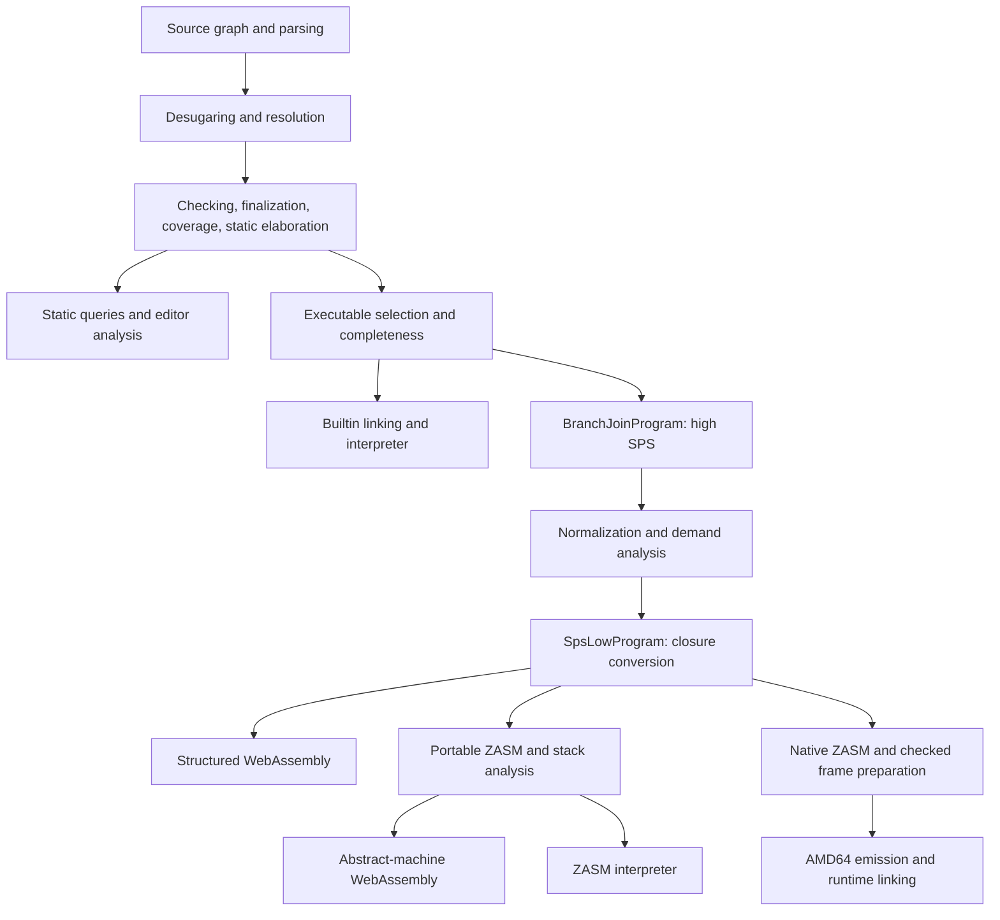

# Compiler implementation reference outline

This is the proposed contents of the reference for Zydeco maintainers.
It is an outline for writing and consolidation, not a completed implementation manual.
The [reference plan](../todos/reference-plan.md) records the investigation baseline and migration decisions;
the [language reference](language.md) supplies the draft source-semantic account.

Organize the reference around phase contracts and the lifetime of a program,
with a crate and symbol index for navigation.
A maintainer should be able to locate a bug, identify the invariants a change must preserve,
and follow a source feature through every affected execution surface.
Keep routine setup and commands in [CONTRIBUTING.md](../../CONTRIBUTING.md).

Each phase chapter should state its input and output representations, owner and entry point,
identity and storage lifetime, required and established invariants, failure behavior, and focused validation.
Worked transformations should show why an invariant is needed.
Link to language rules rather than independently restating acceptance or erasure semantics.

## C1. Architecture and a program's path through the compiler

- Workspace responsibilities, frontend entry points, and the distinction between analysis, executable selection,
  interpretation, and compilation.
- The single-root program model and the representations at each phase boundary.
- One worked source-to-execution trace using a package field containing a returning thunk: imports and witnesses,
  residualization, explicit control, closure conversion, and backend selection.
- A second trace through rejection and diagnostics, including the retained source snapshot.

The current pipeline is:

Audit this map against [command orchestration](../../cli/src/compile.rs),
[session phases](../../lang/session/src/source/pipeline.rs), [SPS pipeline](../../lang/stackir/src/pipeline.rs),
and [ZASM pipelines](../../lang/assembly/src/pipeline.rs).
Expand the architecture overview from [DESIGN.md](../../DESIGN.md#implementation-architecture).

## C2. Compiler data, identities, arenas, and source provenance

- Typed IDs, key spaces, sequential allocation, derived occurrence identities, and replay.
  Explain why a source binder, a checking occurrence, and a runtime value need different identities.
- Arena schemas, allocation capabilities, owning stores, side tables, and explicit insertion semantics.
- Builder mutation, frozen outputs, shared phase products, and phase-local metadata deltas.
- Cardinality of provenance relations across parsing, repeated checking, elaboration, and lowering.
- Compact byte spans, rebasing into a program source map, source snapshots, and conversion to user-facing locations
  and LSP UTF-16 positions.

Use [arena and ID invariants](../../DESIGN.md#arena-and-id-invariants),
[arena utilities](../../lang/utils/src/arena.rs), [span utilities](../../lang/utils/src/span.rs),
and [surface span storage](../../lang/surface/src/textual/span.rs).
Use [the source-map exploration](../ideas/span-source-map.md) for design context.

## C3. Source loading, sessions, queries, and memory retention

- Canonical paths, filesystem providers, overlays, numbered inputs, companions, dependency discovery,
  cycles, assembly, and hygienic source boundaries.
- `CompilerSession`, revision ownership, Salsa inputs, `ScopedData`, and `TyckDb`.
- Checked and rejected analysis results, checked-program materialization, executable selection,
  and consumers that need the complete arena.
- Coarse source checking, allocation-producing judgment queries, and demand-driven fact queries.
  Explain the checker-owned mutable inference core and the limits of query memoization.
- Retained indexes versus occurrence payloads, `Arc` sharing, eviction, re-materialization,
  and database-generation lifetimes.

Use [the session implementation](../../lang/session/src/source),
[statics query inputs](../../lang/statics/src/query/input.rs), the achieved form
of [query-owned statics](../proposals/query-owned-statics.md#achieved-form-2026-08-14),
and [arena reclamation](../proposals/arena-gc.md).
Validate with [session tests](../../lang/session/src/source/tests.rs) and query-local tests.
Keep historical memory measurements labeled with their workload and revision.

## C4. Parsing, desugaring, and name resolution

- Logos tokens, LALRPOP strict and recovering entry points, literal validation, and parse diagnostics.
- Textual syntax, metadata, spans, trivia, and source intentions; the concrete information later formatting needs.
- Bitter syntax and desugaring of binding headers, quantifiers, products, packages, named components,
  annotations, and source boundaries.
- Scoped syntax, lexical environments, binder collection, block dependency graphs, strongly connected components,
  recursive groups, and residual mobile-binding sites.
- Completion-hole identity and scope snapshots as clients of ordinary resolution.

Use [textual](../../lang/surface/src/textual/README.md), [bitter](../../lang/surface/src/bitter/README.md),
and [scoped](../../lang/surface/src/scoped/README.md) component guides together with their implementation modules.
The tests should cover strict/recovered parsing, source hygiene, deterministic block ordering,
and the language rules in L2–L3.
Tree-sitter conformance belongs to the tooling and validation chapters.

## C5. Typed representation, judgments, and inference

- Sorted kinds, types, patterns, values, and computations; pre-nodes, fills, annotations,
  normalized views, abstract identities, and package-witness evidence.
- `Tycker`, `Tyck`, synthesis and analysis actions, term/pattern dispatch, environment handling, allocation sites,
  source observations, and diagnostic guards.
- Checked-term reuse for independent source synthesis, classifier extraction, and monadic payloads;
  reconcile use-site expectations after canonical synthesis.
- Constraint generation, compatibility, shape refinement, speculative rollback, occurs checks, scope intersections,
  witness escape, and inference-region closure.
- Substitution, type reduction, hole resolution, arena-wide normalization, and publication.
  Separate these operations from the static value evaluator in C6.
- Mechanism-specific guides for recursive bindings, named lookup, selective opening, and dependent function application.

Use [the checker guide](../../lang/statics/src/check/README.md),
including its [solver invariants](../../lang/statics/src/check/README.md#inference-regions-and-solver-invariants)
and [checked-term reuse](../../lang/statics/src/check/README.md#classifier-extraction-and-checked-term-reuse),
[driver](../../lang/statics/src/check/driver.rs), [source handling](../../lang/statics/src/check/source.rs),
[typed syntax](../../lang/statics/src/syntax.rs), [arena](../../lang/statics/src/arena.rs),
and [normalization modules](../../lang/statics/src/normalize).
Link the formal judgments to [the existing calculus](../../lang/statics/type-system.typ).
Use [statics tests](../../lang/statics/tests), [inference tests](../../lang/tests/tests/inference.rs),
and source-family integration tests.

## C6. Typed elaboration, residualization, and validation

- Type-directed copattern elaboration into shared argument matches and unique codata arms.
- Monadic basis validation and algebra translation of a retained checked payload.
- Static values: lexical evaluator state, static closures, runtime references, pattern binding, witness inspection,
  residual computation traversal, and representation checking.
- Original source root and executable residual root in one unpublished typed arena;
  retained editor facts and the shared interpreter/compiler boundary.
- Finalization order: close inference, resolve and normalize, validate coverage, then elaborate the static root.
  Explain subsequent executable-hole validation and optional type linting.
- Coverage matrices, specialization, correlated counterexamples, and bounded searches;
  typed-arena well-formedness and partial re-derivation by the lint.
- User diagnostics versus invariant failures; failures before runtime effects, resource-limit diagnostics,
  and the absence of silent backend fallback.

Use [static elaboration](../../lang/statics/src/elaborate/static_values),
[monadic elaboration](../../lang/statics/src/elaborate/monadic),
[copattern checking](../../lang/statics/src/check/copattern.rs), and [validators](../../lang/statics/src/validate).
Consolidate the implementation portions of [normalization](../proposals/normalization.md),
[exhaustiveness](../proposals/exhaustiveness.md), and [type linting](../proposals/tyck-lint.md).
Use [static-elimination](../../lang/tests/tests/static_elimination.rs), [coverage](../../lang/tests/tests/coverage.rs),
[monadic](../../lang/tests/tests/monadic.rs), and [lint](../../lang/tests/tests/tyck_lint.rs) regressions.

## C7. Linking and the reference interpreter

- Erasure into `DynamicsProgram`, one runtime root, and materialization of the typed Builtin package.
- Dynamic syntax, semantic values, environments, thunks, continuation state, and the stepping loop.
- Calls, returns, codata observations, matching, recursion, and host transfers.
- Pure inspection and interactive evaluation versus the executable Builtin boundary.
- Runtime errors, captured I/O in tests and the REPL, resource handles, and foreign-call loading.
- Which source behaviors the interpreter checks against the compiled backends,
  and which allocation or performance characteristics are interpreter-specific.

Use [the dynamics guide](../../lang/dynamics/src/README.md), [linker](../../lang/dynamics/src/link.rs),
[runtime syntax](../../lang/dynamics/src/syntax.rs), [evaluator](../../lang/dynamics/src/eval.rs),
and [host resources](../../lang/dynamics/src/host.rs).
Cross-reference L6 for source dynamics and C14 for shared host contracts.

## C8. High SPS lowering, normalization, and demand

- Stack-passing style and the lexical branch-join fragment; a lowering judgment indexed by the consuming stack.
- Shared IR forms and high-phase value, stack, and computation syntax.
  Explain branch joins, ambient stacks, explicit sharing, and single-occurrence ownership.
- Structural lowering of residual user code and Builtin fields into `BranchJoinProgram`.
- Known producer/consumer reductions for thunks, calls, returns, products, and matches; body sharing,
  discardability, traps, and effect preservation.
- The `Absent` / `Fields` / `Used` demand lattice, pattern demands, and branch joins.
  Unknown consumers conservatively require complete arguments.
- Primitive thunk recognition, direct arithmetic, returning-continuation reduction, constant evaluation,
  and residual external calls.

Use [the Stack IR guide](../../lang/stackir/src/README.md), [high lowering](../../lang/stackir/src/high/lower.rs),
[normalizer](../../lang/stackir/src/high/normalize.rs), [demand analysis](../../lang/stackir/src/high/demand.rs),
and [high validation](../../lang/stackir/src/high/check.rs).
The [pattern implementation account](../proposals/exhaustiveness.md#literal-and-alias-patterns)
records integer decision lowering and shared alias bindees.
Consolidate [residual normalization](../proposals/normalization.md#residual-sps-normalization)
with [demand analysis](../proposals/demand-analysis.md).
Validate using [demand tests](../../lang/tests/tests/demand.rs) and pipeline-local primitive tests.
L10 defines mandatory source elimination; this chapter owns the optional residual transformations.

## C9. Closure conversion and first-order SPSLow

- Free-variable analysis and fresh structural conversion from lexical high SPS.
- Code labels, blocks, jumps, explicit closure packages, continuation packages, argument frames,
  and closure/continuation opening.
- Captured environments and residual stacks: what is packaged, what is erased,
  and how definitions and provenance survive conversion.
- The `SpsLowProgram` contract: one root, closed blocks, lexical node ownership, and retained branch-join invariants.

Use [low syntax](../../lang/stackir/src/low/syntax.rs), [conversion](../../lang/stackir/src/low/convert.rs),
[validation](../../lang/stackir/src/low/check.rs), and [the consuming pipeline](../../lang/stackir/src/pipeline.rs).
Show corresponding high and low terms before explaining storage details.
Record the precise paper-to-code correspondence without treating a research calculus as the complete implementation.

## C10. ZASM, stack analysis, and local representation choices

- Materializing a control-flow graph from SPSLow; instruction, block, label, environment,
  and operand/control-stack representations.
- Logical product arity versus physical fields, closure layout, and representation choices attached
  to lexical occurrences.
- Local pack/unpack fusion, direct closure forcing, and variable expansion for projection-only uses.
- Stack and environment analysis, slot assignments, the ZASM interpreter, and the common portable lowering used
  by assembly-derived targets.
- The native lowering fork and the invariants it must establish before frame preparation.
  Keep planned stack-allocated products and interprocedural escape analysis distinct from delivered local unboxing.

Use [ZASM syntax](../../lang/assembly/src/syntax.rs), [lowering](../../lang/assembly/src/lower.rs),
[analysis](../../lang/assembly/src/analyze.rs), [unboxing](../../lang/assembly/src/unbox.rs),
and [interpreter](../../lang/assembly/src/interp.rs).
Extract the implemented subset of [escape analysis and unboxing](../proposals/escape-unboxing.md).

## C11. Native preparation, activation frames, and AMD64 emission

- `NativeProgram` as a checked input to emission; activation ownership, entry kinds, initialized bindings,
  continuation provenance, and frame planning failures.
- Frame layouts, packed slots, pending-continuation liveness, and aliasing of return slots.
- Entry, local branch, suspension, return, and tail-transfer invariants.
  Retained return-continuation slots and independently escaping closure captures have different lifetimes.
- Mapping planned operations to AMD64 registers, machine-stack words, alignment, frame-base updates,
  jumps, and native host bridges.
- Native build artifacts, runtime source packaging, target selection, and tool invocation;
  link to the commands in CONTRIBUTING rather than duplicate them.

Use [frame preparation](../../lang/assembly/src/frames.rs), [AMD64 emission](../../lang/amd64/src/emit.rs),
[native packaging](../../cli/src/native.rs), and [native frame invariants](../proposals/native-frames.md).
Use [native-model regressions](../../lang/tests/tests/native_model.rs).
The default uses retained frames with growable storage; compact environments remain a selectable experiment,
and the moving-environment prototype is not an AMD64 backend.

## C12. Shared native model, allocation, and collection

- The dependency-free `zydeco-machine` boundary: word encoding, closure records, host-transfer records,
  frame actions, and source-fingerprint artifact pairing.
- Immediate and boxed numeric representations, products, closures, host-owned text and buffers,
  and collector-visible versus opaque payloads.
- The environment storage contract, nested frame tokens, failure atomicity, relocation at entry,
  and enumeration of live initialized slots.
- Cheney semispace allocation and collection, deferred root publication, suspended frames, control-stack roots,
  registered host roots, and interior-pointer handling.
- Block-start indexing, forwarding, copying, sharing and cycles, capacity limits, and failure after collection.
- Experimental compact and managed environments: their implemented interfaces, evidence,
  and additional obligations without treating them as the production default.

Use [the machine model](../../lang/machine/src/lib.rs), [frame model](../../lang/machine/src/frames.rs),
[runtime stub](../../runtime/stub.rs), [collector](../../runtime/gc.rs),
and the model boundary in [native frames](../proposals/native-frames.md).
Validate with model unit tests, [native-model tests](../../lang/tests/tests/native_model.rs),
and [GC tests](../../lang/tests/tests/native_gc.rs).
Distinguish reclamation of compiler arenas in C3 from collection of program values here.

## C13. WebAssembly backends and embedding

- The fork at SPSLow and the contracts shared through `wasm-common`.
- `wasm-sps`: block functions, locals, tagged code handles, trampolining, explicit closure packages,
  and persistent stack frames.
- `wasm-am`: ZASM program points, program counter, dispatch loop, reusable environment,
  operand/control stack, and stack failure paths.
- Module imports and exports, linear memory, runtime words, spare scalar boxes, returning and control host calls,
  and fatal runtime errors.
- The Node test host, I/O and resource behavior, and the boundary between module and embedding.
- Current limits: non-collecting heaps, the AM stack capacity, unsupported native FFI,
  and the test host's argument-fold and randomness restrictions.

Use [shared Wasm support](../../lang/wasm-common/src), [AM emission](../../lang/wasm-am/src/emit.rs),
[SPS emission](../../lang/wasm-sps/src/emit.rs), and [the test host](../../lang/tests/wasm-host.mjs).
Extract the implemented paths and unresolved default-target decision
from [WebAssembly strategies](../proposals/wasm-backends.md).
Keep historical benchmark results tied to the exact compared implementations.

## C14. Builtin contracts, primitive operations, and foreign calls

- The single typed role catalog and intrinsic identities, Builtin signature validation,
  and structural package materialization in interpretation and lowering.
- Fixed-representation types versus provider-owned capabilities; returning and continuation-selecting operation shapes.
- Primitive arithmetic semantics and backend instruction selection.
  Link C8's normalization rules rather than duplicating primitive-call rewrites.
- Resource tables, text/byte representation adapters, error-kind mapping, and shared observable I/O behavior.
- Validated `ForeignSignature` plans, argument flattening, Unix libffi loading, AMD64 marshalling and return bridges,
  and Wasm rejection.
- A maintainer's map for adding a primitive across the contract, checker, interpreter, lowering, runtime,
  both Wasm emitters/host, and conformance tests.

Use [syntax and roles](../../lang/syntax/src/lib.rs), [Builtin validation](../../lang/statics/src/builtin.rs),
[foreign signature validation](../../lang/statics/src/foreign.rs),
[Builtin lowering](../../lang/stackir/src/builtin.rs), [interpreter FFI](../../lang/dynamics/src/foreign.rs),
and [the public contract](../../lib/std/builtin.zy).
Use the [package identity rationale](../proposals/package-modularization.md#primitive-identity-and-package-boundaries)
for design context.
Extract implementation details from [bytes](../proposals/bytes.md),
[filesystem](../proposals/filesystem.md), and [C FFI](../proposals/c-ffi.md).
L13–L14 own their source and trust contracts; C11–C13 own target-specific layouts.

## C15. Diagnostics, formatting, documentation, and interactive tooling

- Structured diagnostic codes, semantic relationships, source snapshots, suppression of consequential errors,
  nominal-identity explanations, and frontend rendering.
- Textual formatting with retained trivia and intentions; formatter laws and directives;
  scoped debug printing versus elaborated type rendering.
- Recovering completion, exact cursor identity, lexical scope, type compatibility, ranking, import-path candidates,
  and stale-revision rejection.
- Cajun analysis and configuration, hover, semantic tokens, definition/reference/rename,
  and byte-to-client position conversion.
- Documentation attachments, semantic provenance, public exposure paths, links and search, generated references,
  and bounded example checking.
- The TUI engine, numbered submissions, retry behavior, inspection/evaluation selection,
  and captured output; Tree-sitter and editor-client integration boundaries.

Use [session tooling](../../lang/session/src/source), [Cajun](../../editor/cajun/src),
[TUI](../../tui/src), and [CLI documentation](../../cli/src/documentation.rs).
Consolidate [completion](../proposals/completion.md), [formatting](../proposals/formatting.md),
[typed rendering](../proposals/typed-type-rendering.md), [documentation](../proposals/documentation.md),
and [REPL](../proposals/repl.md) implementation accounts.
Keep user-facing authoring and configuration workflows in their existing guides.

## C16. Validation, debugging, and extending the implementation

- The evidence layers: lexer/parser laws, typed source acceptance and rejection, arena linting,
  IR invariant checkers, interpreter observations, backend parity, and focused native layout/GC/FFI tests.
- Data-driven cases versus Rust tests inspecting internal facts; exact diagnostic and failure assertions;
  whole-program examples and their declared backend coverage.
- Tracing one bug through source provenance and intermediate representations.
  Document how to choose a focused test before broadening verification.
- Change maps for a syntax form, typing rule, primitive, optimization, and backend representation: owners,
  downstream consumers, required reference updates, and regression locations.
- Reproducible performance investigations: revision, workload, compiler and runtime profiles, host/target,
  measured quantity, and default versus experimental representation.
- Documentation maintenance and reference examples, including checked/rejected fences and runtime fixtures.

Use [the test harness](../../lang/tests/src/lib.rs), [case directives](../../lang/tests/cases/README.md),
[data-driven cases](../proposals/data-driven-cases.md), and [CONTRIBUTING.md](../../CONTRIBUTING.md#run-tests).
Link [runtime evaluation](../ideas/cbpv-runtime-evaluation.md) for historical experiments and methods;
its exploratory alternatives are not additional phase requirements.
The full workspace suite remains an explicitly requested verification pass.

## Appendices

- Crate, module, phase-entry, and program-type index.
- Source construct to typed form, residual form, and lowering route.
- Invariant index with its establishing phase, consumers, verifier, and regression tests.
- Native and Wasm ABI tables derived from their owning declarations.
- Diagnostic and debug-output guide, with stable codes distinguished from incidental wording.
- Paper and design-record correspondence, including retained open questions and historical evidence.

These are navigation and audit views of the chapter contracts.
They should point to one owner for each invariant, including shared typing, erasure, frame lifetime,
host transfer, and product representation rules.
