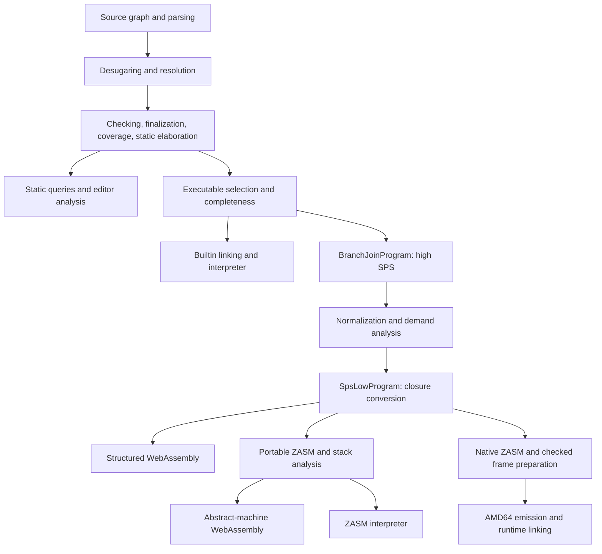

# Zydeco compiler implementation reference

This reference describes the compiler's current representations, phase contracts, and maintenance entry points.
It assumes basic programming-languages background.
The [language reference](language.md) owns source semantics;
[CONTRIBUTING](../../CONTRIBUTING.md) owns setup and command-line workflows.
Component guides map local modules, and linked design records retain alternatives and open decisions.

Each completed program has one selected root. Each phase establishes the representation its consumers need;
source identities and diagnostic provenance survive even when runtime structure is erased or rebuilt.
The distinction between source checking, executable selection, and backend preparation is essential
when locating failures.

1. [Architecture and a program's path](#c1-architecture-and-a-programs-path-through-the-compiler)
2. [Compiler data and identities](#c2-compiler-data-identities-arenas-and-source-provenance)
3. [Sources, sessions, and retention](#c3-source-loading-sessions-queries-and-memory-retention)
4. [Parsing and resolution](#c4-parsing-desugaring-and-name-resolution)
5. [Checking and inference](#c5-typed-representation-judgments-and-inference)
6. [Elaboration and validation](#c6-typed-elaboration-residualization-and-validation)
7. [Reference interpreter](#c7-linking-and-the-reference-interpreter)
8. [High SPS and normalization](#c8-high-sps-lowering-normalization-and-demand)
9. [Closure conversion](#c9-closure-conversion-and-first-order-spslow)
10. [ZASM and local representations](#c10-zasm-stack-analysis-and-local-representation-choices)
11. [Native preparation and emission](#c11-native-preparation-activation-frames-and-amd64-emission)
12. [Native runtime and collection](#c12-shared-native-model-allocation-and-collection)
13. [WebAssembly](#c13-webassembly-backends-and-embedding)
14. [Builtin and foreign contracts](#c14-builtin-contracts-primitive-operations-and-foreign-calls)
15. [Tooling](#c15-diagnostics-formatting-documentation-and-interactive-tooling)
16. [Validation and extension](#c16-validation-debugging-and-extending-the-implementation)

## C1. Architecture and a program's path through the compiler

[CommandCompiler](../../cli/src/compile.rs) adapts the revisioned compiler session to CLI commands and tests.
[CompilerSession](../../lang/session/src/source/query.rs) owns source inputs and analysis;
its products distinguish retained analysis facts, a complete checked program, and an executable computation.
The interpreter and every compiled target start from the same checked source and static-elimination boundary.
Compiled targets use stack-passing style (SPS), where arguments, destructor observations,
and return continuations form explicit stacks.



The main boundaries are concrete program types:

| Product | Establishing entry point | Consumer |
| --- | --- | --- |
| `TextualProgram`, `BitterProgram`, `ScopedProgram` | [Source assembly and surface pipeline](../../lang/session/src/source/pipeline.rs) | The next frontend phase |
| `ProgramAnalysis` | `CompilerSession::analyze` | Diagnostics and tooling facts |
| `CheckedProgram` | `CompilerSession::checked_program` | Full typed-tree inspection |
| `ExecutableProgram` | `CompilerSession::executable_program` | Builtin root linking or lowering |
| `DynamicsProgram` | [BuiltinRootLinker](../../lang/dynamics/src/link.rs) | Reference interpreter |
| `BranchJoinProgram` | [BuiltinRootLowerer](../../lang/stackir/src/high/lower.rs) | High SPS normalization |
| `SpsLowProgram` | [SpsLowPipeline::run](../../lang/stackir/src/pipeline.rs) | Structured Wasm or assembly lowering |
| `AssemblyProgram` | [LoweringPipeline::run](../../lang/assembly/src/pipeline.rs) | ZASM interpreter or AM Wasm |
| `NativeProgram` | `LoweringPipeline::run_native` | AMD64 emitter |

Consider this executable, which exits successfully:

```zydeco check
param (/Int64; /process) : @(import("../../lib/std/builtin.zy")) in
let api = (#run = { fn (n : Int64) => ret n }, #spare = 7) in
do code <- ! api/run 0;
! process/exit code
```

Source loading checks the Builtin signature independently.
Checking resolves `api/run` to a structural field route and relates `process` to the executable's package witnesses.
Static elaboration erases static evidence while retaining the explicit thunk and computation calls.
High lowering constructs the product and its consuming stack.
Normalization exposes the known field and thunk, binds `n` to `0`, forwards the return
into `code`, and removes unused package fields.
Any remaining closure crosses C9 as a package with explicit captures.
The selected backend then realizes the remaining host exit; the interpreter executes the checked residual term directly.

A source error stops before that fork:

```zydeco reject=tyck.unconstrained-inference at=1:4
fn x => ret x
```

Its inference region cannot close. The session retains a rejected analysis with diagnostics and available facts;
`CommandCompiler::analyze` reports rejection, and executable selection cannot produce a backend input.
Load, parse, desugar, and resolve failures retain the source information available at their own boundary.

## C2. Compiler data, identities, arenas, and source provenance

An ID's Rust type identifies its node category; its opaque key space and raw index identify an allocation.
A source binder, a particular checking occurrence, and an emitted runtime value are different identities.
[The arena utilities](../../lang/utils/src/arena.rs) separate issuing those IDs from owning and accessing their storage.

| Mechanism | Invariant |
| --- | --- |
| `IdAllocator<Scope>` | One non-cloneable sequential issuer owns a fresh key space and cursor. |
| Derived allocation | Entity identity, checking occurrence, derivation family, and local slot reproduce an allocation site. |
| `Allocates<Id>` | A capability declares which categories an operation may issue. |
| `ArenaSchema<Id>` | An owning representation declares the item stored under an ID. |
| Dense storage | The backing arena supplies the raw index and rejects another arena's key space. |
| Sparse, paged, and indexed storage | Producer-issued IDs retain their identity when storage changes. |
| Associative side tables | Each write explicitly inserts, replaces, upserts, or ensures an association. |
| `FrozenArena<A>` | Consumers receive storage without the builder's indexed-mutation capability. |

Sequential issuers normally live on a parser, resolver, or lowerer rather than its published arena.
High SPS retains its definition issuer until consuming closure conversion moves it into the low administrative arena;
low syntax has a separate issuer and never reuses high syntax IDs.
Statics producer queries derive occurrence IDs, while the checker materializes their returned fragments.
Rechecking the same source entity in a distinct occurrence must not overwrite an earlier elaboration.

Provenance records the actual relation between representations.
Surface-to-typed mappings are many-to-many because transparent syntax and repeated checking can share
or duplicate results; one typed node may produce several IR nodes.
Parsed entities use the tagged `EntityId` category rather than casts between definition, pattern, and term IDs.
Generated definitions and phase-local provenance belong to the phase that creates them.

[Span](../../lang/utils/src/span.rs) stores two `BytePos(u32)` endpoints: eight bytes per span.
Compact byte positions avoid retaining a path, line, and column at every syntax node.
A `FileMap` owns a file's path, retained text, global base, and line-start index;
`SourceMap` orders files by their global base.
File-local parsing starts at byte zero.
Merging rebases spans into one address space beginning at one, reserving the zero span for a dummy location.
The [merged surface span arena](../../lang/surface/src/textual/span.rs) owns the source map;
a cached parse template retains its local file map until assembly.

Location rendering finds the file and line by binary search and derives character columns from retained text.
It performs this work on demand, including after rejection; a `ResolveFailure` retains the error and span arena.
Editor conversion to UTF-16 belongs at the protocol boundary and does not change compiler byte offsets.
Before comparing a global span with an editor's file-local cursor or range, localize it through the owning map.
File attribution alone cannot validate this conversion: source-location tests must also check hover
and token ranges in non-ASCII text and in files beyond the first merged source.

Allocation and provenance changes should exercise arena tests and source-location tests,
including repeated checking and the distinction between local and merged spans.

## C3. Source loading, sessions, queries, and memory retention

The [source graph](../../lang/session/src/source/graph.rs) identifies canonical paths,
numbered inputs, imports, and type companions.
The [loader](../../lang/session/src/source/loader.rs) obtains source text through session inputs,
including editor overlays; [assembly](../../lang/session/src/source/program.rs) combines providers
with explicit source and signature boundaries.
Dependency cycles are diagnosed before checking.
The independence of provider inference and source scope is specified in [L12](language.md#12-sources-imports-and-entry).

`CompilerSession` is the Salsa database and revision owner.
[ScopedData](../../lang/statics/src/query/input.rs) connects the resolved root,
primitive definitions, scoped arena, and spans to `TyckDb`.
The coarse [check_source query](../../lang/statics/src/query/source.rs) runs the mutable checker, finalization,
coverage, and static elaboration together, then publishes an `Arc<StaticsArena>` and a checked or rejected outcome.
Splitting those phases into separately copied arenas would multiply the dominant materialization cost.

### Query and checker ownership

Allocation-producing syntax judgments are producer queries: they return node identities
and immutable outcomes from explicit inputs.
The checker inserts those outcomes into its materialized arena.
The [intrinsic singleton query](../../lang/statics/src/query/intrinsic.rs) derives identities
from a synthetic check-wide site, independent of the first source occurrence naming an intrinsic.
The checker materializes those singletons before judgments read `IntrinsicStatics`.
Unification, fill resolution, substitutions, package opening, copattern elaboration,
and recursive-group processing retain a checker-owned algorithmic core.
Their intermediate results depend on mutable inference state; replaying a site alone cannot reconstruct that state.

A cached node must therefore be distinguished from a pure source-to-judgment function.
Per-call arena snapshots would make query keys expensive and defeat reuse;
a tracked mirror does not make an arbitrary table cell reconstructible from its site.
A worklist redesign of the solver would be a separate algorithmic change.
The current boundary gives producers deterministic identities while letting inference retain its sequential state.
C5 defines the publication boundary after that state stops changing.

### Analysis facts and materialization

`analyze_source` builds documentation while the complete arena is available,
then retains `StaticsArena::clone_keyed_indexes()` in `ProgramAnalysis`.
That analysis is a source and fact snapshot, not a complete typed tree.

| Retained keyed information | Transient occurrence payload |
| --- | --- |
| Definition annotations, bodies, alias entry points, and intrinsic roles | Typed values, computations, and patterns |
| Fill sites, solutions, scopes, and abstract identities | Per-occurrence kinds and types |
| Data/codata definitions, term facts, normalized top annotations, and provenance indexes | Derived node columns needed during full-tree traversal |

Fact queries read those retained indexes. Full-tree consumers call `materialize_arena`, `checked_program`,
or `executable_program`, which recover the arena through the coarse check.
Materialization uses the session's current inputs, so callers must pair an analysis
with the matching session revision or snapshot.
Live consumers share the complete arena through `Arc`; lowerers add phase-local metadata instead of cloning it.
Checker-only state, including per-node typing environments, is stripped before full-arena publication.
Cajun may keep a project's materialization alive while that project is in use.

`check_source` has a one-entry LRU configuration.
The test session pool explicitly triggers eviction between analyses and periodically replaces its database generation.
Fine-grained judgment memos have a different lifetime from the full arena;
dropping an analysis alone does not promise reclamation of all database storage.
[Retention design questions](../proposals/arena-gc.md) concern memo lifetime, compact facts, and parsed-source storage.
[Session tests](../../lang/session/src/source/tests.rs) and query tests check facts after eviction,
re-materialization, source hygiene, and failed revisions.
Compiler cache reclamation is independent of program-value collection in C12.

## C4. Parsing, desugaring, and name resolution

[Textual syntax](../../lang/surface/src/textual/README.md) owns Logos tokens, literal decoding,
LALRPOP parsing, metadata syntax, spans, trivia, and retained layout intentions.
Strict parsing supplies compilation input; recovering parsing supplies structured holes
and recovery evidence for tooling.
A recovered edit is not silently accepted as an executable program.
Formatting consumes the same textual model, so parser changes must preserve the information required by C15.

[Bitter desugaring](../../lang/surface/src/bitter/README.md) removes surface sugar while keeping unresolved names.
It expands binding headers and telescopes, makes nominal sealing and CBPV introductions explicit,
and retains special boundaries such as classifier queries and monadic payloads.
Source assembly has already resolved import and literal splices.
Primitive terms have compiler-owned identities, and every generated node records its textual origin.
A special metadata node must survive whenever ordinary forwarding would change its checking environment or expectation.

[Resolution](../../lang/surface/src/scoped/README.md) replaces names with `DefId`s and records lexical contexts.
A source boundary resets the environment.
In a block, resolution first collects mobile contributions and installs all their binders,
then resolves occurrences and builds dependency edges from right-hand sides and annotations.
SCCs form a condensation DAG; source order breaks ties and orders recursive members.
Parameters become abstractions, acyclic definitions become lets, and recursive type components become `RecGroup`.
`Residual` indirections preserve ownership at the original mobile sites after binders move.

Resolution establishes binder identity before dependency ordering moves syntax;
scheduling must preserve those identities.
The checker subsequently verifies the admissibility of a recursive group.
The context collector records visible and free definitions from the elaborated term,
allowing completion to reuse scope rather than reconstruct it from later types.
Parser agreement, recovery laws, formatting laws,
and the [uniform-term fixtures](../../lang/tests/cases/uniform-term) exercise this boundary.
The [term design](../proposals/term.md) retains its binding motivation and remaining recursion questions.

## C5. Typed representation, judgments, and inference

The [checker guide](../../lang/statics/src/check/README.md) maps the implementation modules.
`Tycker` carries one source check's mutable state; `Tyck` and `PatternAction` select synthesis or analysis.
Term and pattern dispatchers own task stacks, allocation-site guards, prepared expectations, and source-fact recording.
Syntax-family rules should use those entry points so recursive judgments preserve the same administrative invariants.

[Typed syntax](../../lang/statics/src/syntax.rs) separates kinds, types, patterns, values, and computations.
`TermAnnId` pairs a sorted term with its classifier.
Kinds and types may initially contain fills; annotations, environments, nominal identities,
and source occurrences are recorded in the [statics arena](../../lang/statics/src/arena.rs).

| Mechanism | Typed representation and checking responsibility |
| --- | --- |
| Kinds and type functions | `VType`, `CType`, arrows, named kinds, type abstraction/application, and substitution |
| Nominal and abstract types | Seals, `AbstId`s, definition bodies, and witness scopes |
| Ordinary CBPV functions | `Arrow`, `Forall`, abstractions, and value/type application |
| Value functions | `ValPi`, its binder sort, and witness projections for structured arguments |
| Value calculations | `Value::Match` with value arms and `Int64ValueOp` with two checked integer operands |
| Packages | `Exists`, manifest equations, `ManifestKind`, and static-prefix patterns |
| Dependent computation functions | `PackPi` with canonical witnesses and a dependent codomain |
| Products and named fields | Component vectors, labels, and resolved routes with physical product positions |

### Inference and reuse

The [source inference rules](language.md#4-classification-and-inference) determine where flexible value types arise.
`InferenceRegion` in [source.rs](../../lang/statics/src/check/source.rs) records inherited fills at entry;
closing the region rejects newly introduced pattern fills whose solutions remain incomplete.
A source closes independently before `CheckedTerm::reconcile_k` compares an import-site expectation.

[Compatibility](../../lang/statics/src/check/lub.rs) combines constraints through `Lub`.
[Shape refinement](../../lang/statics/src/normalize/inference.rs) creates component fills
of the required CBPV sorts and retains their originating site.
Filling checks occurs and visible-skolem conditions.
Sharing a flexible type across occurrences intersects admissible scopes; subsequent solutions obey that intersection.
A failed speculative fill restores both solutions and scopes.
Diagnostics retain the inference site and the conflicting body or call-site constraints.
Lexical and abstract-witness substitution follow solved type holes before rewriting their solutions.
This lets an inferred factory result specialize independently at each application, including value-function fields;
the shared solution itself remains unchanged.

`CheckedTermRepository` retains a canonical result per resolved term for sources,
classifier queries, and monadic payloads.
Reuse requires a context extension preserving every original binding and visible witness;
repeated or nested requests must agree on the arena root.
This permits a recursive annotation to be revisited after recursive bindings are installed.
A `TypeOf` boundary synthesizes its operand once, extracts and scope-checks the existing classifier IDs,
and reconciles expectations afterward.
It does not forward its own expectation, annotation, or seal into the operand.
In particular, direct extraction from `ret v` relies on recording `Ret A : CType` correctly.

### Package evidence and lookup

A manifest entry checks its equation and substitutes it through the remaining telescope;
an abstract entry introduces an identity subject to scope checks.
Source formation and opening rules live in [L9](language.md#9-polymorphism-and-packages).
`functions` establishes canonical witness telescopes for dependent binders
and substitutes caller-visible evidence at application.
A runtime thunk's implementation can be unknown while its signature supplies the dependency.
Value-function witness projections separately record which structured argument components supply evidence.
`PackPiInstantiationState` consumes the physical leading existential prefix
and substitutes its abstract witnesses through the codomain.
`ValPi` has a separate projection-based argument representation;
its structured evidence handling does not extend `PackPi` to witnesses nested beneath arbitrary product fields.

[Projection checking](../../lang/statics/src/check/projection) resolves a unique route
through the receiver's allowed structure, including the identities shared by one selective package opening.
The resolved route records every product position and its product type.
Selected runtime fields elaborate to ordinary typed patterns; unselected static positions receive internal witnesses.
A whole-package alias carries the same opening's prefix for forwarding.
Witness inspection uses C6's static reducer and never obtains evidence by executing a computation.

### Finalization

After inference closes, hole solutions are stable for the remainder of finalization.
[Resolution and normalization](../../lang/statics/src/normalize) share memo tables across every arena root,
rebuilding changed paths and reusing results for shared tails.
Original IDs remain valid lookup keys; `kinds_normalized` and `types_normalized` store changed finalized views,
while unchanged IDs expose their existing nodes.
Missing solutions and sort errors remain diagnostics.

The shared context bounds structural traversal by the graph's nodes and edges, plus reductions that create new nodes.
Starting a fresh memo at every root would repeatedly traverse shared package-signature tails.
Compiler-owned identity maps use the repository's fast internal hashing;
changing storage must preserve key-space identity.
Finalized annotations feed coverage, residualization, and editor facts.
[Inference](../../lang/tests/tests/inference.rs), [classifier-query](../../lang/tests/tests/typeof.rs),
and [statics tests](../../lang/statics/tests) cover closure, scope, rejection, and reuse.

## C6. Typed elaboration, residualization, and validation

Elaboration turns checked source mechanisms into a form shared by execution backends.
It runs in the unpublished arena so the source root and source facts remain available
while generated nodes acquire fresh identities and provenance.
The coarse check orders judgments, hole resolution, type normalization, coverage,
and static-root elaboration before publishing its result.

### Monadic and copattern elaboration

[Monadic checking](../../lang/statics/src/check/monadic.rs) checks the supplied `Monad` and `Algebra` basis,
synthesizes the payload once under its monadic environment, and passes a `CheckedTerm`
to the [algebra translation](../../lang/statics/src/elaborate/monadic).
The translator constructs lifted types, structures, and terms, rebinding their static evidence into the output context.
It translates the retained checked payload rather than rechecking its source under unrelated expectations.
[L11](language.md#11-relative-monads) specifies the source translation and basis;
generated code must satisfy the same finalization and residual representation boundaries as ordinary terms.

[Copattern elaboration](../../lang/statics/src/check/copattern.rs) follows the expected residual classifier:
a codata step groups destructor clauses, an arrow step introduces a shared argument
and accumulates its patterns, and a universal step introduces a type binder.
On reaching bodies, pending argument patterns become a correlated match.
A package-dependent boundary currently admits one clause whose witnesses can scope the dependent result.
The output has one typed arm per destructor and hints identifying generated argument matches and package binders.
Repeated source destructors can therefore be exhaustive alternatives over arguments
without becoming duplicate typed arms.

### Coverage

[Coverage validation](../../lang/statics/src/validate/coverage.rs) consumes normalized typed syntax
and its data/codata hints.
It converts variables, holes, and admitted alias groups to wildcards, preserves structural heads and product arities,
erases package witnesses, and treats literal observations as opaque to structural coverage.
Opaque patterns contribute no wildcard row.
This implements the conservative source policy in [L7](language.md#7-patterns-and-coverage).

A matrix row is one alternative; its columns are simultaneous constraints.
For a selected head, specialization removes that head and inserts its payload columns.
Wildcard rows specialize to wildcard payloads.
The default matrix keeps wildcard rows and removes their first column.
Data heads have one payload, product heads have their component arity, unit has none,
and named wrappers and existential packages each have one dynamic field.
Typed view observations remain opaque unless their nested pattern is already a wildcard.
The uncovered-row recursion has these base cases:

```text
no columns: one uncovered empty row iff the matrix has no rows
no rows and no known head space: an all-wildcard uncovered row
no head space: recurse into the default matrix
finite head space: recurse for every head, then rebuild its uncovered patterns
```

Keeping columns together preserves correlations: rows `(+True(_), _)`
and `(_, +False(_))` leave `(+False(_), +True(_))` uncovered.
Product matrices retain their typed component vectors and explicit nesting.
A known empty data space has no inhabitants.
Generated copattern argument matches use the same procedure; separate codata validation checks missing
and duplicate typed destructors.

Diagnostics retain at most eight uncovered witnesses and probe for a ninth to mark truncation.
That bounds reported evidence, not the coverage decision.
Normalization and local errors prevent malformed rows from reaching this pass.
[Coverage tests](../../lang/tests/tests/coverage.rs) pair accepted matrices with correlated gaps,
empty types, and nested observation failures.
[Remaining pattern decisions](../proposals/exhaustiveness.md) cover usefulness, literal matching extensions,
and refutable conjunctions.

### Static elimination

[Static elaboration](../../lang/statics/src/elaborate/static_values) uses a lexical evaluator
whose values can contain static closures, package structure, and shared references to runtime data.
It reduces type/value applications, known constructors, projections, package openings,
value matches, and integer value operations.
For example, applying `val x => (x, x)` to a runtime variable produces a shared residual binding and product;
the runtime variable need not become a compile-time constant.
Computation thunks remain suspended, and general computation execution supplies no static evidence.

The frontend materializes each integer value intrinsic as a curried value abstraction around a typed leaf operation.
Value-match checking infers the result sort from its arms, or from the expected classifier for an empty match;
value and computation matches share coverage validation.
Residualization evaluates the selected value arm in a cloned lexical environment and folds integer leaves to literals.
Application-site provenance keeps failures in generated primitive bodies attached to source calls.
The interpreter and compiled backends have no runtime case for these static operations.

`StaticShape` supports witness inspection during dependent checking, including package and product structure.
It exposes only caller-visible witnesses and returns opaque evidence when reduction cannot establish them.
`StaticElaboration` records the original source root and an optional residual root:
an unapplied static library export can be checked without having a runtime representation of its own.
Reification creates fresh typed residual nodes, preserving runtime sharing and effect order.
Representability checks cover surviving values, thunk bodies, and computation classifiers after instantiation.

The source elimination requirements and reducer resource limits are specified
in [L10](language.md#10-static-elimination).
A residualization failure reports `tyck.static-elimination` at its source site;
exhausted witness inspection supplies no evidence.
Both linking and SPS lowering select the stored residual root.
[ExecutionReadiness](../../lang/statics/src/validate) rejects reachable executable holes before effects;
typed holes may still be inspected during ordinary checking.
[Static-elimination regressions](../../lang/tests/tests/static_elimination.rs) distinguish erased library structure,
runtime payloads, shared runtime data, and failed evidence recovery.

### Typed-arena lint

[LintChecker](../../lang/statics/src/validate/lint.rs) is an optional independent verifier over a complete arena.
It checks fill closure, annotation presence and sorts, agreement of surface-keyed and node-keyed views,
and existence of referenced nodes and definitions.
Kind comparisons resolve normalized structure; raw kind-ID equality is insufficient after reconciliation.
The well-formedness sweep includes orphaned allocations left by retries.
Abstract-witness kinds can come from their annotation, a denoting type node, or an enclosing binder;
requiring an `annotations_abst` row for every witness would reject legitimate artifacts.

[Re-derivation](../../lang/statics/src/validate/rederive.rs) checks type-former kinds across the whole arena.
Supported term-constructor shapes and witness binding are checked from source, residual,
and definition roots, using the documented ambient-witness policy.
Roots include recorded aliases, inlinable and type definitions, data/codata arms, and seals.
Supported introduction shapes cover thunks, returns, named values, units, and literals;
operand-dependent checks exclude abstract identities and applications other than `Thk` and `Ret`.
Shared nodes can have different use-site instantiations,
so the verifier cannot soundly compare every recorded parent/child annotation
or reconstruct every lexical reference context from this artifact.
Its visited-node cache checks a shared node under the first encountered scope only.
Those limits and proposed stronger checks remain in the [lint design](../proposals/tyck-lint.md).

`CommandCompiler::with_lint_types`, exposed as `--lint-types`, runs the verifier
after a successful check and outside query memoization.
Findings are typed internal errors and abort the gated command; they are not source diagnostics.
Its hole policy also detects non-foreign term placeholders, so this verifier has a stricter completion expectation
than ordinary hole inspection.
[Mutation tests](../../lang/tests/tests/tyck_lint.rs) must show that a seeded corrupt fact is detected,
paired with clean cases that prevent false positives.

## C7. Linking and the reference interpreter

[Linking](../../lang/dynamics/src/link.rs) selects residual syntax, erases types
and witnesses, and constructs `DynamicsProgram`.
Builtin root linking materializes the host package from its validated typed signature;
foreign declarations remain checked call plans until their runtime loader is used.
Named routes become structural tuple access, and aliases preserve a shared bindee.

[Runtime syntax](../../lang/dynamics/src/syntax.rs) separates dynamic terms from semantic values,
environments, suspended computations, and continuation state.
The [stepper](../../lang/dynamics/src/eval.rs) evaluates values, forces thunks,
consumes arguments and destructor observations, matches data, and resumes return continuations.
A thunk captures its lexical environment; `fix` supplies explicit computation recursion.
No backend-specific demand or frame optimization changes this reference evaluation path.

The interpreter uses Rust representations for values and host resources rather than the native tagged heap.
Its allocation behavior therefore does not predict native or Wasm costs.
The runtime borrows its input, output, error, and argument interfaces from the caller;
CLI runs use process streams, while tests and the REPL supply captured streams.
`ProgKont` distinguishes continuation outcomes, exit status, dry execution, and runtime errors.
An executable failure is reported at this boundary rather than silently retried on another target.

The [dynamics guide](../../lang/dynamics/src/README.md) maps runtime modules.
[C14](#c14-builtin-contracts-primitive-operations-and-foreign-calls) owns shared host roles and call plans;
[L6](language.md#6-computations-and-control) owns source dynamics.
Source regressions and runtime parity tests use the interpreter as one observable execution surface.

## C8. High SPS lowering, normalization, and demand

[High lowering](../../lang/stackir/src/high/lower.rs) is indexed by the stack consuming a residual computation.
It builds complete user and Builtin structures into `BranchJoinProgram`.
High SPS retains lexical values, closures, continuations, arguments, and explicit ambient stacks.
Stack lets guard value-coproduct matches so every branch shares one supplied continuation stack.
The [high verifier](../../lang/stackir/src/high/check.rs) checks closed roots, lexical ownership,
and this branch-join shape.

[SpsLowPipeline](../../lang/stackir/src/pipeline.rs) validates high SPS, normalizes it,
validates the rebuilt program, and consumes it through closure conversion.
These optimizations are optional consequences of known runtime structure;
they do not relax L10's source elimination boundary.
The normalizer preserves definition identities while allocating fresh syntax for the surviving lexical tree.

### Local reductions

The [normalizer](../../lang/stackir/src/high/normalize.rs) records lexical facts for aliases,
literals, products, constructors, and suspended code.
Its principal reductions are:

```text
force (closure • => M) S          ==> M[S/•]
let arg(p) :: • = arg(v) :: S in M ==> let p = v in M[S/•]
return v to (kont p => M)         ==> let p = v in M
kont x => return x to •          ==> •
closure • => force f •           ==> f
```

Forwarding uses a variable `f` or a plain continuation binder.
Known destructor tags select their comatch arm; known constructors select their match arm and bind the payload.
Matching product introductions and patterns split into bindings in evaluation order.
A selected value branch can drop its join guard; an unknown branch retains the shared stack.

Substitution preserves the producer's lexical environment and the captured ambient stack.
It stops at stack binders, including closures, recursion, argument consumers, comatch arms, and branch joins.
Moving a remaining stack requires its argument values to be discardable;
tags recurse through the stack, and continuation bodies stay suspended.
A trapping argument retains its evaluation boundary.
The popped head argument is bound before the consumer executes.

### Sharing and discardability

A directly forced closure literal reduces. A variable-bound general closure can move into its force only
with one syntactic occurrence; counts conservatively include dead code.
Shared closures stay bound, and aliases do not establish exclusive ownership.
Recursion is never unfolded. Value aliases forward without copying compound values;
nontrivial literals substitute only through singly used bindings, while trivial values can forward freely.
A returned value used repeatedly keeps one binding.

Discardability determines whether an unused producer may disappear.
Variables, literals, trivial values, and suspended closures are discardable;
products and constructors inherit it from their contents.
Arithmetic is discardable only when total and its operands are discardable.
Integer division, remainder, and holes retain possible traps unless literal folding proves successful evaluation.
Executed external calls and `Fix` remain even if their result is unused.
A dead suspended thunk can disappear without inspecting its recursive body.
These conditions preserve the order and multiplicity of effects while local reductions expose further consumers.

### Consumer demands

[Demand analysis](../../lang/stackir/src/high/demand.rs) is the backward component of the same traversal:

| Demand | Observation |
| --- | --- |
| `Absent` | No surviving consumer needs the value. |
| `Fields` | Consumers need specified physical product positions and nested demands. |
| `Used` | An unknown consumer requires the complete value. |

Join unions field positions recursively, and `Used` absorbs other demands.
An empty `Fields` map still observes product shape and differs from `Absent`.
At `let p = V in M`, producer facts first normalize `M`; its free-definition demands are translated
through `p` into a demand on `V`.
The rebuilt producer contributes its own free demands, and demands for bound definitions leave the map.
Independent branches join before the producer is rebuilt.
There is no global demand fixed point or recursive-call specialization.

A known call exposes argument and return bindings before demands are read,
allowing a consumer to prune a passed package.
Unknown calls observe arguments whole.
Escaping thunk bodies contribute demands on their captures while remaining suspended.
A surviving constructor match observes its scrutinee whole; known selection removes demands from discarded arms.
Forcing a thunk observes that thunk, not a projection of its eventual result.

Logical suffix patterns translate into physical product positions by shifting their nested demands.
A rebuilt suffix spread retains the required product arity even when its individual fields are absent.
Alias members join demands on the same scrutinee; a whole-value use
through one alias defeats selective pruning by another.
Eliminating an unpack can also eliminate its shape demand.
An unobserved field becomes trivial only when its producer is discardable.

Source value and parameter classifiers also contribute the [partial protocol evidence](#partial-source-protocols)
retained across rebuilding.
Discarded producers lose their evidence; whole retained values and parameters carry it to closure conversion.
Codata tag producers and consumers use the canonical observation numbering defined at that same boundary.

### Primitive calls

A known primitive thunk initially has the form `closure • => extern f •`.
Recognizing it through aliases, projections, or constructor payloads exposes the external call even
at several call sites: only the operation identity is copied, with each site's original stack.
Known integer or float arithmetic with two visible arguments becomes `Primitive { operation, operands }`:

```text
extern add (arg(x) :: arg(y) :: (kont z => M)) ==> let z = PrimitiveAdd(x, y) in M
```

The argument stack's construction order evaluates the second operand before the first.
The remaining stack must satisfy the movement conditions above.
The result stays shared, and exposing its continuation as a binding avoids allocating a continuation package.
Literal folding obeys [L13's numeric rules](language.md#13-primitive-values-and-capabilities).
A zero divisor remains a runtime operation at its original position, even if its result is unused.

Escaping arithmetic retains its thunk interface, with an inline primitive in its body.
An unknown callee remains indirect; other known Builtin operations remain external calls.
The typed primitive survives SPSLow and ZASM, where C11 and C13 select native or Wasm arithmetic instructions.
Word decoding, encoding, and conditional boxing still follow the target representation;
this optimization does not prove that all scalar boxes disappear.

### Pattern decisions and validation

Integer literal match plans lower to the raw `BuiltinValueRole::Integer(t, Eq)` branch
with success and failure continuations.
There is no structural literal-pattern node in SPS.
Structural aliases survive high and low SPS; assembly saves and reloads their bindee,
while direct SPS Wasm uses a local.
Resolved field routes already consist of ordinary structural patterns and erased witness evidence.

Normalizer and pipeline tests pair reductions with shared closures, traps, unknown branches, and suspended recursion.
[Demand tests](../../lang/tests/tests/demand.rs), [pattern fixtures](../../lang/tests/cases/literal-pattern),
and [core fixtures](../../lang/tests/tests/core.rs) exercise package pruning and compiled decisions.
A new reduction needs both a reducible example and a case where sharing, stack movement, or effects prevent it.

## C9. Closure conversion and first-order SPSLow

[SpsLowConverter](../../lang/stackir/src/low/convert.rs) consumes lexical high SPS and creates fresh low syntax.
Free-variable analysis determines ordered captures; renamed capture bindings close each generated block.
A closure becomes an explicit environment and code package.
Its entry unpacks the captured environment before consuming ordinary arguments.
A continuation packages its code and residual stack, including the bindings needed when it resumes.
Force and return become package opening followed by a jump.

[Low syntax](../../lang/stackir/src/low/syntax.rs) separates `Block`, `Jump`,
`ClosurePackage`, `ContinuationPackage`, `OpenClosure`, and `OpenContinuation`.
Products, primitives, patterns, and external-call forms share their structural vocabulary with high SPS.
Source captures remain value identities; code labels and lexical syntax nodes belong to the new low arena.
Administrative definition allocation continues from the consumed high program as described in C2.

`SpsLowProgram` has one root and first-order closed blocks.
Its [verifier](../../lang/stackir/src/low/check.rs) checks reference closure,
lexical node ownership, retained branch joins, and the word entry contracts below.
A single-occurrence syntax tree means runtime sharing is explicit in variables;
it is not a proof that a continuation is dynamically used once.
Native preparation must establish the stronger lifetime facts in C11.
Structured Wasm can consume this representation directly because block boundaries and residual stacks are explicit.

### Word entry contracts

Closure conversion introduces words that have no corresponding source argument:
a closure's captured environment and a continuation's saved environment.
Making their roles explicit lets callers and code entries agree before assembly lowering chooses stack operations.
A returned source value also has an explicit entry role.
The remaining source arguments and effects still use the residual stack.

Each `Block` declares [EntryParameters](../../lang/stackir/src/low/entry.rs),
and each `Jump` supplies an `EntryArgument` before its residual stack:

| Entry kind | Parameters in consumption order | Word supplied by the jump | Residual stack at the jump |
| --- | --- | --- | --- |
| Closure | Environment | Environment from the closure package | Ordinary argument/effect stack |
| Continuation | Result, environment | Returned result | Saved environment followed by the caller's stack |

Every listed parameter occupies one ordinary target value word, including a product or buffer handle.
`EntryParameters::words` fixes their order for both ZASM lowering and direct SPS Wasm emission.
The block's patterns bind these parameters before its body executes;
ordinary `LetArg` nodes in the body consume subsequent user arguments.
`OpenContinuation` restores the residual stack, so returning supplies only the result word.
The explicit entry forms replace administrative `LetArg` prologues and `Arg` prefixes in SPSLow.
Their lowering preserves the existing physical word convention.

The [entry verifier](../../lang/stackir/src/low/contracts.rs) checks a code value's origin
and entry kind at each package construction and jump.
A block and its recursive self label carry the declared kind.
Known unit/product environments must agree with a direct block's outer environment arity;
unknown shapes remain subject to upstream source typing.
This is a partial shape check, not reconstruction of the erased source types or their field classifiers.

Opening a closure establishes a local association between its code and its whole environment.
An indirect jump or repackaging must preserve that association.
Opening a continuation similarly associates its code with the restored residual stack;
returning or repackaging must use that same residual stack.
Code from one opening cannot consume another opening's environment or continuation stack,
even if both packages happen to have the same shape.
The verifier propagates evidence through whole-value aliases and projections of known complete products.
Destructuring an opaque environment does not establish permission to reconstruct an equivalent one.
Stack operations retain evidence when their known pushes and pops cancel; a remaining prefix or a pop
into the opaque restored stack loses the required agreement.

These checks assume source typing and closure conversion establish the shapes of dynamically obtained packages.
The administrative checks are supplemented by the partial source protocol checks below.
Neither establishes continuation lifetime or reconstructs complete source typing.
Host and C external calls retain their own upstream signatures and transfer contracts.
Local representation policies must preserve the ordinary word transport at this boundary;
source storage alignment and padding alone cannot select a different call layout.

For native retained-frame lowering, `ContinuationEntry` additionally records the result pattern,
body, and ordered capture bindings.
The verifier compares that metadata with the explicit continuation entry and its package
before C11 replaces portable captures with retained slots.
There is no second executable entry prologue to infer or keep synchronized.

### Partial source protocols

The compiler retains a partial description of the source stack protocol so
that known call components can be checked after normalization.
This description follows [Ret and stack extent](language.md#ret-and-stack-extent):
an installed continuation hides its saved residual stack, and there is no end-of-frame constructor.
In particular, an argument prefix followed by `cont(A)` does not bound the stack extent or allocation lifetime.

[ValueProtocol and StackProtocol](../../lang/stackir/src/protocol.rs) are owned IR data extracted
from checked classifiers.
Values retain unit, primitive, product, and thunk structure when known.
Codata interfaces retain observation alternatives in an owned `ProtocolGraph` shared by the high and low arenas.
Disclosed seals and applied type functions can lead back to existing graph instances.
Unresolved first-order value and computation witnesses retain program-local parameter names and their kinds.
Universal binders retain their scope in the descriptor, while captured parameters can occur freely in local entries.
Unsupported higher-kinded applications, existential carriers, and other unsupported forms contribute unknowns.

| Stack descriptor | Interpretation |
| --- | --- |
| `?` | Unknown protocol; no statement about whether the stack is empty or how large it is |
| `aN` | A named computation parameter; repeated occurrences retain a relationship |
| `forall aN . S` | A source type binder around `S`, consuming no runtime stack component |
| `A :: S` | One argument classified by `A`, followed by protocol `S` |
| `cont(A)` | An installed continuation accepting `A`, with its saved stack hidden |
| `pN` | A program-local reference to a codata interface's observation alternatives |
| `.d#i :: S` | A producer has supplied observation `.d`, with runtime tag `i`, above remainder `S` |

Each codata instance receives a graph reference before its observations are translated.
Recursive occurrences with the same captured arguments reuse that reference,
including cycles through argument prefixes or thunk components.
This keeps a finite description even when executions accumulate an unbounded number of observations and arguments.
The graph records no physical stack extent.

The [source extractor](../../lang/stackir/src/protocol/source.rs) interprets disclosed type-function applications
against the frozen checked arena, without allocating substituted types or rerunning the checker.
A source expression carries lexical bindings for the witnesses that its supported structure uses freely.
Applying a checked type abstraction binds the argument to its witness;
a named binder projects its payload, while a plain binder keeps the whole argument.
Nested abstractions capture the outer arguments they use.
Known named projections, value products, thunk protocols, and computation arguments use these bindings as well.
For example, `Stream A R = codata .item : A -> Stream A R; .done : R end` retains an `Int64` payload
and `cont(Int64)` result when applied to `Int64` and `Ret Int64`.
Applying the same family to `Char` preserves a separate instance.

Instance keys contain the source codata identity and its captured source expressions and bindings.
They do not use partial protocol compatibility to equate arguments; distinct unresolved witnesses remain distinct keys.
Only an existing exact instance closes a recursive edge.
When a source codata is already being translated under different arguments,
a new application contributes unknown instead of starting another specialization.
For `Growing A` whose next observation requires `Growing (A * A)`,
the current observation retains its known payload and the changing tail remains opaque.
The same guard covers growth through returned thunks.
Repeated source nodes along unguarded reduction or value/argument paths also stop conservatively.
These guards impose no unfolding-depth limit, but can lose evidence for finite nested applications too.
General nonregular recursion remains outside this instantiation procedure.

Observation indices are the zero-based ranks of complete destructor names in lexicographic order within the interface.
High lowering obtains both pushed tags and case tags from the descriptor's canonical ordering.
Consequently, structurally equal codata interfaces agree on runtime indices even
when their source declarations list observations in different orders.
Both the name and index participate in low protocol checking.

High lowering records value and pattern protocols, recursive entry protocols, and the interface of each codata case.
Normalization copies facts for retained whole values and patterns into the fresh arena;
discarded values and pruned product fields do not retain stale whole-value facts.
Surviving cases keep their interface, and rebuilding shares the immutable graph while preserving its references.
Primitive results can recover their scalar protocol from the typed operation itself.
Closure conversion transfers these facts to the low arena and records an `EntryProtocol` for each block.
Closures retain their incoming source stack protocol, and continuation entries retain the accepted value protocol.
Recursive self labels inherit the same entry descriptor as their block.
These descriptions come from checked classifiers, not a count of leading `LetArg` nodes.

The [protocol verifier](../../lang/stackir/src/low/protocols.rs) checks known components before SPSLow is published.
It compares a closure's protocol with the supplied argument stack,
and a continuation's accepted value with the result delivered to it.
Entry kinds agree with administrative roles; known incoming parameter protocols agree
with their retained source pattern classifiers.
Bindings, aliases, product projections, and package openings propagate local evidence.
An opened thunk supplies its code's protocol; an opened continuation supplies the code's accepted value protocol
while its restored stack becomes opaque to this analysis.
The separate provenance check still associates that code with the exact restored stack.

For a supplied observation, the verifier selects that alternative from the expected codata descriptor
and checks its remainder.
A retained case checks its supplied stack against the declared interface, validates branch coverage and tag indices,
and checks each branch against the selected observation's protocol.
This branch evidence remains available even when the ambient stack became opaque at a continuation opening.
SPSLow publication validates graph and parameter references, including parameter kinds, before examining transfers.

The [agreement checker](../../lang/stackir/src/protocol/agreement.rs) compares the whole transfer
with a fresh constraint set.
Each side has its own parameter namespace, and each universal occurrence gets a fresh scope.
Within a scope, repeated occurrences of a parameter share constraints.
For example, `forall A . A -> Ret A` agrees with `Int64 :: cont(Int64)` but rejects `Int64 :: cont(Char)`.
Two separately quantified thunk components can each instantiate the same source binder differently.
A computation parameter can relate a callback's required protocol to the stack supplied after it.
The SPS verifier skips leading universal binders when inspecting the next runtime stack component;
these binders never add a physical stack word.

Parameter constraints retain every known partial shape rather than selecting one representative.
For example, observations of `(?)`, `(Int64)`, and `(Char)` for one value parameter must still reject:
the unknown field cannot discard the later concrete conflict.
Ordinary unknown occurrences remain independent gaps, including repeated visits to an unknown codata payload.
For a computation parameter, different supplied tags can select different alternatives of the same interface;
a known complete interface must admit each supplied observation with its proper index and remainder.

Comparison builds finite local graphs keyed by codata reference and relevant captured parameter bindings.
Already compared graph components close recursive comparisons, while every other observation remains checked.
Parameters bound outside a recursive interface stay related across its observations.
A universal binder introduced inside a codata interface is retained in the published descriptor,
but its parameter positions are treated as unknown during agreement.
Fresh instantiation at each observation needs a further comparison extension;
reusing one inferred argument for every visit would reject valid polymorphic observations.
Fixed components and recursive observation coverage remain checkable under this conservative treatment.
Changing captured bindings along a recursive comparison also leaves an opaque component.
There is no unfolding-depth limit or runtime iteration bound.

Unknown components are compatible with the existing word transport, and only known conflicts are rejected.
This relation is nontransitive; successful agreement cannot establish type equality or authorize a different ABI.
Abstract storage-carrier identity remains an upstream source typing property; agreement checks consistent known shapes,
without reconstructing the explicit type arguments erased before SPS or proving parametricity of a generic body.
Those remain upstream typing obligations. Layout/reference-map evidence is not reconstructed.
Host and C external transfers keep their existing signature checks.
No frame-size, frame-lifetime, or stack-scanning plan is derived from these descriptors.

`zydeco build --target zir` displays entries such as `closure[Int64 :: cont(Int64)]`
and `continuation[Thk(Int64 :: cont(Int64))]` alongside their administrative word parameters.
It also prints finite definitions such as:

```text
[protocol:p0] codata { .done#0: cont(Int64); .item#1: Int64 :: p0; }
```

Parameter declarations print their kinds, for example `[parameter:a0] VType` and `[parameter:a1] CType`.
A polymorphic relay can retain an entry such
as `closure[forall a0 . forall a1 . Int64 :: a0 :: a0 :: Thk(a0 :: a0 :: a1) :: a1]`.
These names describe source relationships and convey no representation size or allocation policy.

[Protocol regressions](../../lang/tests/tests/stack_protocols.rs) check those surviving descriptions,
rejected argument/result and observation conflicts, graph integrity, and a source computation
that accumulates a runtime-dependent number of argument/tag frames before its installed continuation.
That program dynamically selects and returns its codata consumer, and also calls a returned arithmetic worker
through a recursive computation-polymorphic forwarder on all backends.
The [declaration-order regression](../../lib/tests/core/codata-order.zy) exercises equal structural interfaces
with reversed source ordering on all backends.
The [parameterized regression](../../lib/tests/core/parameterized-protocols.zy) instantiates one recursive family
with both `Int64` and `Char`, including a dynamically selected and returned stream thunk.
Low mutation tests reject an incompatible payload after the first recursive observation.
The [growing-family regression](../../lib/tests/core/growing-protocols.zy) checks
that conservative extraction still permits successive observations with larger product types on all backends.
The [symbolic relay](../../lib/tests/core/symbolic-protocols.zy) calls one recursive worker
at different value and computation types on all backends.
Its low mutation test rejects conflicting arguments for one parameter.

## C10. ZASM, stack analysis, and local representation choices

[Assembly lowering](../../lang/assembly/src/lower.rs) consumes SPSLow into a control-flow graph
with explicit operand and control stacks, environment variables, labels, and instructions.
[StackAnalyzer](../../lang/assembly/src/analyze.rs) assigns the stack/environment locations needed by that graph.
The portable result is an `AssemblyProgram` for the [ZASM interpreter](../../lang/assembly/src/interp.rs) or AM Wasm.
Native lowering selects a distinct frame-aware path before preparation.

[ProductLayout](../../lang/assembly/src/syntax.rs) distinguishes logical arity from the physically stored fields.
Tuple tails and projections must respect that distinction; a suffix pointer refers into an existing payload.
Closure package layout is derived from the shared machine model rather
than a separately maintained field-order convention.
Changing packing must update patterns, closure opening, stack analysis,
and collector interior-pointer handling together.

[LocalUnboxing](../../lang/assembly/src/unbox.rs) runs over SPSLow
while producer/consumer relationships remain explicit.
It marks immediate product construction/elimination pairs, direct closure forcing, variable-bound products
whose uses are all suitable projections, and local closure bindings whose uses all open the closure.
Lowering then omits the corresponding pack/unpack pair or expands a variable into field slots.
Alias uses and escaping or unknown consumers retain the ordinary boxed representation.
Escape classification follows occurrences of the candidate variable through values and residual stacks;
an unrelated primitive, constructor, or closed block does not constitute an escape.
The explicit environment/result arguments of a jump are escaping uses
under the [word entry contract](#word-entry-contracts).
SPSLow's closed-block invariant places captures in explicit environments and continuation residuals.

### Policy selection

[RepresentationPolicy](../../lang/assembly/src/representation.rs) separates a preference
from the analysis that justifies it.
The collector first establishes a compatible producer/consumer shape and the required local use evidence,
then asks the policy about an `UnboxingOpportunity`: its reason and field-word count.
Accepting every opportunity cannot waive an escape, width, or calling-contract restriction.
Rejecting a closure's expansion also prevents expansion of an environment transported inside that boxed closure.
Fields retain their ordinary tagged-word representation; the policy cannot assign raw scalar or pointer layouts.

| Policy | Selected opportunities |
| --- | --- |
| `Boxed` | Keep residual product and closure cells. Earlier SPS normalization still runs. |
| `Direct` | Immediate product elimination and opening of a syntactic closure package. |
| `Local` (default) | `Direct`, plus a variable-bound product used only through compatible projections. |
| `Shared` (experimental) | `Local`, plus a variable-bound closure used only through closure openings. |

Each policy is a Rust type. `RepresentationStrategy` selects the same policies through a runtime enum.
`LoweringPipeline::with_representation` accepts a policy type or the enum and produces an immutable assembly program;
the policy is consumed during compilation and adds no runtime representation dispatch.
Custom Rust policies can restrict selection by reason or width without replacing the collector or the emitters.

`CommandCompiler::with_representation` and `BackendProgram::with_representation` provide per-compilation enum selection.
Changing a backend program's strategy invalidates its cached portable assembly.
Native frame preparation consumes the same policy before establishing its frame and root maps.
The CLI's `build --representation` applies to ZASM, AMD64 assembly/executables, and AM Wasm.
An explicit selection for Zir or SPS Wasm is rejected because those paths do not consume this analysis.
The old process-wide `ZYDECO_DISABLE_UNBOXING` switch has been removed; select `Boxed` explicitly instead.

The delivered analysis is local representation selection.
It does not implement the proposed three-way choice among unboxed fields, stack-allocated products,
and region-allocated products, or interprocedural escape propagation.
Those choices and their constraints remain in [escape and unboxing](../proposals/escape-unboxing.md).
Local analysis tests and core execution cases should verify both allocation removal and the uses that retain boxing.
The [policy experiment](../../cli/examples/representations.rs) compares residual allocation sites and field words,
including a Rust const-generic width limit; these are static code counts, not executed allocations or peak memory.
The [execution fixture](../../lib/tests/core/representation-policies.zy) exercises a locally opened recursive closure
with live captured values.
See [the contribution workflow](../../CONTRIBUTING.md#representation-experiments) for reproducible commands.

## C11. Native preparation, activation frames, and AMD64 emission

[NativeProgram::prepare](../../lang/assembly/src/frames.rs) validates the frame-aware ZASM result
before [AMD64 emission](../../lang/amd64/src/emit.rs).
The checked product contains activation ownership, entry contracts, initialized bindings,
continuation provenance, packed frame slots, and root/suspension maps.
Invalid preparation is a `FramePlanError`; emission cannot silently fall back to an unchecked environment layout.

| Entry role | Required transition |
| --- | --- |
| Local branch | Keep the current activation and its established bindings. |
| Closure entry | Establish an activation from captures and incoming arguments. |
| Return continuation | Restore the retained activation and initialize the result binding. |

`ContinuationEntry` provenance records the returned-value pattern, the body after the portable capture preamble,
and the source-to-capture binding relation.
Validation checks these against the actual package and preamble;
metadata does not introduce another executable occurrence.
Native lowering replaces capture construction and unpacking with `RetainFrame` and resumption aliases.
Ownership follows local and suspension/resumption edges; forward dataflow verifies initialized bindings independently
of ZASM context annotations.
Captured aliases resolve recursively to their original definitions.

Slot assignment combines ordinary liveness with preservation by pending continuations.
A later result may reuse a dead slot only when no pending continuation still needs its binding.
Nested continuations can retain different subsets of one activation;
root and interference information must include all pending uses.
A forward may-analysis unions pending captures at joins; a resumption consumes its own suspension
while preserving older ones.
A write interferes with every binding preserved across it, even when the written result is dead.
Deterministic greedy coloring assigns canonical definitions to slots; aliases inherit their source slot.
Packed size is a safe bound from the assigned slots, not an optimal-coloring or recursion theorem.
The same offsets are used for accesses, capture descriptors, and active root maps.

The default retained environment stores frames in growable Rust-owned storage.
Closure entry may reserve and relocate that storage; generated code reloads its active base into `rbp`.
Saved references are logical offsets and tokens, never raw environment-slot pointers in managed values or closures.
Suspend and Resume preserve the model's nesting discipline.
Resuming consumes the most recent pending token, restores the owning frame and frontier,
and releases younger unretained storage.
A tail transfer reuses an unretained active frame or preserves it beneath its callee when a continuation still needs it.

The lifetime justification comes from the concrete lowered stack operations:
SPSLow values cannot contain a residual machine stack, checked continuation bodies cannot refer
to their own entry label, and native continuation opening consumes its token destructively.
Recursive closure invocation establishes another activation instead of reentering a suspended one.
Source `Ret` types and lexical node occurrence counts alone do not establish this property.
Escaping ordinary closures own heap captures with adequate lifetime.
A future machine-stack capture or multi-shot continuation operation must revisit preparation and storage together.

The emitter serializes model-defined actions and implements SysV register placement,
stack alignment, jumps, return prologues, and host bridges.
[Native packaging](../../cli/src/native.rs) bundles the runtime and shared model
and invokes the target toolchain using [CONTRIBUTING's build contract](../../CONTRIBUTING.md#compile-programs).
[Native-model tests](../../lang/tests/tests/native_model.rs) check preparation and transitions;
[native frame design](../proposals/native-frames.md) retains the detailed lifetime argument
and experimental comparisons.

## C12. Shared native model, allocation, and collection

[zydeco-machine](../../lang/machine/src/lib.rs) is a dependency-free `no_std` model shared
by the compiler and native stub.
It owns tagged words, closure records, host-transfer records, and frame actions.
Code generation derives layout from 64-bit carriers; the target runtime checks its `usize` representation against them.
The bundled model sources determine a fingerprinted entry symbol,
so mismatched compiler/runtime source bundles fail to link.
This is artifact pairing, not verification of handwritten instruction selection.

Odd words are immediate. Even words are pointer-shaped.
Narrow integers, `Float32`, characters, tags, and the immediate portions of 64-bit integers fit in a word;
full-width integer overflow of that encoding and all `Float64` payloads use opaque scalar boxes.
Products and closures occupy scanned blocks.
Source numeric domains and immediate ranges are specified in [L13](language.md#13-primitive-values-and-capabilities)
and [the representation account](../../DESIGN.md#numeric-representations).
Aligned host-owned objects outside the managed spaces remain unchanged by tracing.

### Environment actions and roots

[frames::Environment](../../lang/machine/src/frames.rs) exposes Enter, Suspend, Resume, and Roots actions.
Enter reserves before changing state and returns the possibly relocated active base.
Suspend validates captures and creates a tagged token; Resume validates its owner and nesting, then restores the frame.
Roots returns mutable addresses for the active map joined with all pending suspension maps.
Only initialized live slots are roots; reserved capacity and dead tagged words are insufficient evidence of liveness.

The retained store grows geometrically and caches capacity at its high-water mark.
Only successful Enter may relocate retained frame words; Suspend keeps the active base stable.
Slot access uses raw pointers without constructing Rust references over generated-code storage.
Metadata vectors hold indices and checked tokens, so their growth cannot invalidate logical frame references.
Failed word reservation preserves existing words, bases, and tokens;
zeroed capacity does not count as an initialized binding.
Transitions may allocate Rust metadata but do not collect the managed heap;
metadata allocation still has the Rust allocator's ordinary failure behavior.
Root addresses expire at the next attempted environment transition, including a failed reservation.
They identify values and need not coincide with active-layout offsets in every environment implementation.
Managed collection may rewrite those values but cannot relocate their published addresses.
A model declaration generates action headers and serialization order;
emitted records and target carriers share checked alignment.
A return prologue removes `token(F)` while preserving `result :: S`, resumes the owner,
restores `rbp`, and then binds the result.
Returning host and C calls enter that same prologue.
The experimental compact engine implements the same narrower action capability with suspension fragments;
experimental moving environments require a different relocation contract and are not an AMD64 backend.
[The frame design](../proposals/native-frames.md) owns those representation alternatives.

### Managed allocation

The [native stub](../../runtime/stub.rs) uses [CheneyHeap](../../runtime/gc.rs) with two fixed 1 MiB semispaces.
The live graph, including headers, must fit in one space.
Allocation receives a deferred root source: a successful fast allocation does not enumerate roots;
collection requests the control-stack range and live frame slots and updates them in place.
An oversized request can fail before enumeration.
Failure after collection still leaves the relocated live graph valid.

A block-start index finds the allocation owning a word-aligned interior payload pointer.
Copying installs forwarding information and preserves sharing, cycles, and the interior offset.
Cheney scanning traverses pointer-bearing payloads; opaque scalar bits are copied without tracing.
Unmanaged pointers remain stable.
Scanning order and forwarding must never reinterpret scalar bits as managed references.

Host helpers that can trigger collection must publish every live managed word and reload relocated roots afterward.
Raw borrowed C argument frames are discarded before any result-box allocation that can collect.
[GC regressions](../../lang/tests/tests/native_gc.rs) cover roots, interior pointers,
aliasing, cycles, capacity failure, and allocation after collection.
Frame storage reclamation and managed-value liveness are separate obligations.

## C13. WebAssembly backends and embedding

Both emitters produce core `wasm32` modules with `memory`, `entry`, and `_start` exports.
An embedding supplies the `zydeco` import namespace; the module is not a standalone WASI program.
[wasm-common](../../lang/wasm-common/src) owns shared role and word conventions.

| Backend | Input and control representation | Storage consequences |
| --- | --- | --- |
| [wasm-sps](../../lang/wasm-sps/src/emit.rs) | One function for the root and each SPSLow block; structured code and locals inside blocks; a trampoline between blocks | Persistent `[head, tail]` stack frames, boxed products, and a bump heap |
| [wasm-am](../../lang/wasm-am/src/emit.rs) | Portable ZASM program points, a private program counter, instruction functions, and a dispatch loop | Reusable indexed environment, fixed 1 MiB operand/control stack, and a bump heap |

Neither path uses recursive host calls to realize unbounded Zydeco control transfers.
SPS closure code handles are tagged table indices; AM program counters are private untagged indices.
Both heaps grow without collection.
SPS partial products use a pointer into the product suffix; constructors use `[tag, payload]`.
Emission sorts arena-derived IDs before assigning functions, imports, locals,
and static-data offsets; unsupported forms report typed emission errors.
The SPS path retains lexical structure but currently uses a whole-program local plan and uniform product boxing.
The AM path reuses ZASM representation work but emits at machine-program-point granularity.

### Module and host ABI

Source values cross as tagged `i64` words. Pointer-shaped values address module or host-owned representations;
module-created closures and stack packages remain opaque to the host except through the shared protocol.

| Import shape | Contract |
| --- | --- |
| Returning operation | Zydeco arguments as `i64`, one `i64` result |
| Control operation | Arguments as `i64`; result is count, closure, and two argument slots, all `i64` |
| Potential full-width scalar result | A trailing `i32` spare-box address where the operation signature requires it |
| `string_literal` | UTF-8 byte offset and length as `i32`, opaque host string word as `i64` |

Control arity is at most two. Spare boxes belong to the module's allocation protocol;
the host must not invent closure layouts or return unregistered control code.
Native C imports are rejected by both emitters.

The [Node test host](../../lang/tests/wasm-host.mjs) supplies captured I/O, resources, and scalar adapters.
It does not provide a general deployment runtime, and randomness is deliberately restricted for tests.
Argument lookup uses the invocation's supplied sequence; lazy folds use module-created source closures,
so multi-argument traversal needs no host-created closure layout.
[Backend strategy questions](../proposals/wasm-backends.md) retain default-target criteria and historical comparisons.
Conformance tests should distinguish module emission, embedding failures, stack exhaustion, and source runtime failures.

## C14. Builtin contracts, primitive operations, and foreign calls

The [syntax role catalog](../../lang/syntax/src/lib.rs) identifies intrinsics and operations with domain types.
[Static Builtin validation](../../lang/statics/src/builtin.rs) checks the authored
[Builtin signature](../../lib/std/builtin.zy) against those roles.
Interpreter linking and [SPS Builtin lowering](../../lang/stackir/src/builtin.rs) materialize
the validated structural plan.
Neither backend recovers an operation's meaning by parsing a field name.

Canonical representation types have shared intrinsic identities;
provider-owned resource capabilities acquire witnesses through their package opening.
Named structural routes and static fields erase before backend layout.
[L13](language.md#13-primitive-values-and-capabilities) owns source observations,
and [package rationale](../proposals/package-modularization.md#primitive-identity-and-package-boundaries)
explains dependency choices.
Returning and continuation-selecting operations have distinct host call plans.
C8 owns arithmetic exposure and folding; C11–C13 own the resulting target words and calls.

Strings are immutable UTF-8 text and bytes are immutable octets.
Interpreter and native host bytes use the shared [ByteBuffer](../../lang/machine/src/bytes.rs):
`Rc<[u8]>` with a visible start and length.
Interpreter slicing creates a constant-time window whose `as_slice` remains contiguous for foreign borrowing.
Native slicing still copies; native byte handles are leaked boxes outside the managed collector,
with no managed references inside the byte storage.
Realignment first accepts an already-aligned window or reserves `length + alignment - 1` bytes
and selects an aligned window inside the final `Rc` allocation.
Checked reservation and offset failures select the failure continuation.
General allocation failure, including allocation of the `Rc` itself, retains the host's allocation failure behavior;
this is not a fully fallible allocator interface.
The Wasm test host uses `Uint8Array` windows and opaque host handles.
It validates alignment requests and preserves contents, but exposes no borrowed C address.
A future host pointer-export interface must establish the requested alignment when providing physical storage;
the current Wasm test host does not establish a native address guarantee.
Equal octet sequences compare equally regardless of sharing.
The [library guide](../../lib/std/README.md#byte-operation-costs) records the resulting operation costs;
[byte representation](../proposals/bytes.md) retains the alternatives.

Scalar byte encoders return ordinary opaque byte handles.
Decoders use a continuation-selecting host call, with a trailing spare box just like other numeric operations:
opaque for `Int64`, `UInt64`, and `Float64`, unused for narrow results.
Float adapters manipulate raw payload bits on every backend, including the Node host,
so a round-trip does not canonicalize NaNs through a host floating-point conversion.
The [source storage contract](../proposals/bytes.md#explicit-storage-contracts) composes these leaves
without a new compiler IR layout form.
Its stored buffers use the existing byte borrow at the foreign boundary.

[BufferArena](../../lang/machine/src/buffer.rs) is shared by the interpreter and native host.
It owns fixed-size mutable allocations behind non-reused handle IDs.
Interpreter handles are typed host values; native handles use immediate words.
Neither allocation payloads nor table entries contain managed Zydeco references.
Close removes the allocation; freeze copies and aligns the immutable result before removing it.
The Node host supplies corresponding checked handles and detached snapshots.
[Buffer laws](../proposals/bytes.md#mutable-destination-capabilities) own the source-visible state transitions
and errors.

Argument lookup returns one string or selects the missing branch; it retains no Zydeco continuation.
The native host caches argument strings outside the managed heap, with no managed references in the snapshot.
The [source argument library](../../lib/std/system/arguments.zy) supplies traversal and lazy tails.
These use the ordinary closure, activation, and collection protocols, including reuse and abandonment.
The former native host closure and fixed host-root table have been removed.
[Argument regressions](../../lib/tests/builtin/argument-contract.zy) exercise repeated forcing across collection,
live captured wide integers, discarded tails, and invalid indices on all four backends.
Source observations belong to [L13](language.md#13-primitive-values-and-capabilities).

Host resource tables allocate monotonically increasing handle IDs and validate reader and writer operations.
Closing removes the resource, so every alias subsequently observes `Closed`;
identifiers are not source-visible pointers.
Reserved standard-stream capabilities remain open.
The interpreter backs them with injected streams, while native execution uses the process streams.
Primitive success/error branches carry a result or an error kind and message;
[the library](../../lib/std/README.md#streams-and-files) constructs `Result`, `Option`, and typed paths.
Adapters distinguish EOF, empty data, invalid text, I/O errors, and closed resources.
[Capability design](../proposals/filesystem.md) owns stream extensions and resource-lifetime choices.

### Foreign calls

[ForeignSignature](../../lang/statics/src/foreign.rs) is a checked call plan for a returning C thunk.
Arguments are fixed-width integers or `Bytes`; a byte buffer flattens into borrowed pointer
and length, with at most six flattened arguments.
Results are fixed-width integers or `Unit` (C `void`).
Its constructor enforces the flattened bound, and the validated fields remain private.
Expansion yields ordered `ForeignArgument` entries identifying the source parameter and its integer,
pointer, or length component; both execution paths consume that plan.
Checking validates the declared shape, not the external symbol's actual ABI.
The trust and borrowing obligations belong to [L14](language.md#14-foreign-interfaces).

The Unix [interpreter adapter](../../lang/dynamics/src/foreign.rs) lazily loads libraries and symbols,
caches call interfaces by target and signature, and calls through libffi while borrowing scalar argument storage.
Missing libraries and symbols are runtime errors; generated native programs do not depend on libffi.
AMD64 marshals the retained source arguments into a temporary raw C frame, loads the SysV argument registers,
and discards that frame before encoding a result that may allocate.
The full-width result survives collection in a preserved register and resumes the ordinary return continuation.
Integer components retain their width and signedness through the call plan.
Native encoders truncate C return registers to that width before constructing the Zydeco value;
the [SysV ABI clarification](https://gitlab.com/x86-psABIs/x86-64-ABI/-/merge_requests/61)
leaves excess integer register bits unspecified.
Only 64-bit integer results need a spare opaque box; narrow integers and unit fit immediate words.
The libffi adapter uses exact scalar storage and return types for integers,
and its explicit void-return operation avoids reading nonexistent result storage.
Marshalling helpers do not collect.
Native linking uses the library's linker name; interpreter loading uses platform shared-library names.
Native foreign imports are unsupported in Wasm and the ZASM interpreter.

[Foreign signature tests](../../lang/statics/tests/foreign.rs)
and [FFI integration tests](../../lang/tests/tests/ffi.rs) pair valid shapes with unsupported arities,
argument sorts, results, loader failures, and borrowing cases.
[C-to-Zydeco exports and callbacks](../proposals/c-ffi.md#following-boundary) still need their own runtime-entry,
ownership, and reentry design.

## C15. Diagnostics, formatting, documentation, and interactive tooling

Tooling uses the facts established by ordinary source phases and associates results with their source revision.
[Session queries](../../lang/session/src/source/query.rs) supply semantic identities;
[Cajun](../../editor/cajun/src/analysis.rs) adapts them to LSP and discards superseded results.
Rendered labels must not become keys for semantic lookup.

[Type diagnostics](../../lang/statics/src/check/error.rs) carry stable codes and structured relationships;
[report construction](../../lang/session/src/source/report.rs) resolves their source sites and explanatory context.
CLI, TUI, and LSP render those reports for their surfaces.
Retained rejected facts can support useful tooling, while later errors caused solely
by an earlier failure should not manufacture independent evidence.
Definition, reference, rename, hover, and semantic-token operations use current provenance and lexical identity.
UTF-16 conversion happens when reading or writing client positions.

### Formatting and typed rendering

The [textual formatter](../../lang/surface/src/textual/pretty.rs) owns source layout through grammar contexts,
punning, anchored trivia, retained intentions, and boundary composition.
Its laws are semantic preservation, comment retention, canonical convergence, and the selected layout lower bound.
`@[format(...)]` supplies policy to CLI and editor alike; frontend settings must not define another formatter.
[Formatting design](../proposals/formatting.md) owns the detailed layout algebra and families.

The [scoped formatter](../../lang/surface/src/scoped/fmt.rs) is for debug output.
The [statics formatter](../../lang/statics/src/fmt.rs) renders elaborated types for hovers,
diagnostics, and IR inspection.
It uses precedence-aware parentheses, declaration hints for abstract witnesses, and source-shaped manifest entries.
Synthesized projection types cannot generally be recovered by slicing source text.
Typed rendering has no retained trivia and follows the layout rules with ignored source intentions.

The typed renderer remains separate because diagnostics need elaborated distinctions
and some typed entities have no faithful source spelling.
Primitive names and witness hints can be readable without forming a reparseable annotation.
A typed-to-textual reifier or shared precedence vocabulary would introduce another translation contract;
[rendering design choices](../proposals/formatting.md#elaborated-type-rendering) record
when that cost becomes justified.
Interactive type links require semantic anchors from the renderer, never reparsing its text.

### Completion and documentation

[Completion queries](../../lang/session/src/source/query/completion.rs) track the exact cursor hole
through recovery, resolution, and checking.
The session recovers only the current root; imports and companions remain strict.
Assembly remaps the exact cursor node into merged syntax, and desugaring provenance connects it to resolution.
A resolver `ScopeSnapshot` enumerates names through ordinary lookup, preserving shadowing and binder introduction depth.
General names require the original parser expectations to admit a term hole;
a recovered hole in a field-name position is insufficient.
Resolution can retain scope after recoverable unbound references;
a fatal phase failure cannot invent an unvisited cursor's environment.
Resolver scope supplies candidates; incoming analytic annotations supply expectations.
A synthesized placeholder is not an expectation. Multiple visits retain all analytic constraints.
Compatibility is `Equal`, `Unknown`, or `Mismatch`: only proven mismatches are omitted,
and candidates requiring inference remain unknown.
Probes reuse `Lub`, following solved fills but deferring unsolved ones without solution or scope writes.
`Equal` satisfies every analytic annotation without inference; one rigid rejection establishes `Mismatch`,
even when another part of the classifier is unresolved.
Other unavailable or inconclusive evidence remains `Unknown`.
Disposable compatibility checks must not mutate source facts or depend on enumeration order.
The session orders candidates by prefix, compatibility, scope proximity,
and deterministic label order; Cajun projects that order into protocol items.
Missing annotations remain optional, and classifier fit does not prove that every term-level constraint
or unrelated error is satisfied by insertion.
The completion query retains its latest result without installing repaired source or replacing strict analysis;
Cajun checks the revision of its disposable session snapshot.

Source-path completion recognizes the metadata catalog's `Source` argument kind.
It merges filesystem entries and overlays relative to the importing source,
excluding direct self-imports and symlink aliases.
Directories sort before conventional source files.
The edit replaces the current path component with source-language escapes,
preserving quotes, the written directory prefix, and following components.
Numbered imports, unrelated strings, comments, and unfinished escape sequences receive no path suggestions.
[Completion design](../proposals/completion.md) owns recovery guarantees and further candidate families.

[Documentation analysis](../../lang/session/src/source/documentation.rs) connects authored attachment,
typed subject, origin, contract, and use context.
Exposure paths preserve public interface selection and abstraction; renaming a field
or re-exporting a value does not justify inventing a new documentation origin.
Generated references, search, and editor panels share the same semantic index.
The public graph follows exposed classifiers and generic result interfaces without executing arbitrary runtime terms;
recursive paths link back to established subjects.
Selectors use slash-separated field names, `()` for results, and `.` for the root.
Published anchors start with `api`, use UTF-8 hexadecimal `-f-...` field segments
and `-result` result segments, and reject duplicate public paths.
They contain no arena IDs or source offsets.
Builds record the compiler version and SHA3-256 hashes of exact source and guide inputs.
[The authoring guide](../documentation.md) owns user syntax;
the [documentation design](../proposals/documentation.md) retains publication and recovery decisions.

[Example checking](../../lang/session/src/source/documentation/examples.rs) constructs isolated source requests
with paths relative to the owning document.
Worker execution is bounded by time and request/result size.
Checked/rejected fences verify static outcomes and specified diagnostic positions; they do not execute examples.
Run fences are rejected. Revision-sensitive editor actions must reject stale IDs.

### Interactive engine

The [TUI engine](../../tui/src/engine.rs) stores complete submissions as numbered source inputs in a session overlay.
Each recorded number identifies immutable source text; later inputs compose it explicitly with `@(import(N))`.
There is no hidden lexical environment.
Re-importing a computation can repeat effects: history stores source, not memoized runtime results.
Clearing the transcript leaves those importable sources available.
A rejected submission returns to the editor at the same number; retry replaces that unrecorded attempt.

For ordinary input, a generated observation root declares its own Builtin parameter around the imported complete input.
The engine analyzes the direct import first, then tries a `ret` wrapper if the first analysis rejects,
allowing values and returning computations without requiring a user wrapper.
If both analyses reject, it reports the original direct diagnostic.
Static observations use analysis facts; runtime observations link the accepted root with captured output and errors.
Explicit execution goes through the executable entry boundary.

Root command metadata is parsed into typed commands before ordinary submission handling.
Help and quit do not consume a source number; unsupported command arguments are rejected,
and unrecognized metadata remains ordinary language syntax.
[CONTRIBUTING](../../CONTRIBUTING.md#use-the-interactive-repl) owns commands, keys, and retry interaction.
[Deferred interaction work](../todos/deferred-designs.md#repl-history-and-replay) covers persistence and pruning.

## C16. Validation, debugging, and extending the implementation

Choose the first boundary that can state the property being changed,
then assert the observable consequence at the necessary downstream boundary.
A correct interpreter result does not prove IR ownership or native root preservation;
an IR snapshot alone does not prove effect order.

| Change | Focused evidence |
| --- | --- |
| Grammar or formatting | Surface parser agreement, recovery contracts, semantic/comment preservation, idempotence |
| Typing, scope, or a source rejection | [Source fixtures](../../lang/tests/cases) or the relevant Rust integration target, with exact diagnostic codes |
| Typed-arena invariant | A seeded mutation and a clean counterpart in [type-lint tests](../../lang/tests/tests/tyck_lint.rs) |
| SPS reduction or representation | High/low invariant checks, blocked-rewrite cases, and runtime observations |
| Native layout or allocation | Preparation/model unit tests and targeted native-model or GC integration tests |
| Host or FFI operation | Signature rejection tests, adapter tests, declared I/O, and target-specific execution |
| Tooling | Current and failed revisions, exact cursor/site identity, and stale-result rejection |

### Source fixtures and runtime oracles

The [case harness](../../lang/tests/tests/cases.rs) uses `libtest-mimic` to discover one trial per `.zy` file.
Files are source fragments wrapped with the same prelude as `SourceCase`.
Leading ordinary comments select stage, prelude, and expectation;
the [case guide](../../lang/tests/cases/README.md) is the directive reference.
Unknown, duplicated, or inapplicable directives fail a trial instead of weakening its expectation.
Diagnostic spellings are parsed beside their stable compiler codes and round-trip through that shared catalog.
Fixtures also enter the parser/formatter corpus,
so a source edit needs neither manual registration nor a Rust recompilation.

Topic paths name the regression; directives name its phase and expected outcome.
This avoids renaming tests when their stage changes and avoids coupling semantic assertions to rendered error prose.
Using the trial runner directly keeps naming and directive validation explicit.
Rendered-diagnostic snapshots can be added for a distinct presentation contract.
Multi-file imports, arena mutation, desugared-variant assertions, emitted-code structure,
process arguments, and I/O remain Rust tests or whole-program fixtures
because a single-fragment expectation cannot express those relationships.

[The shared harness](../../lang/tests/src/lib.rs) supplies check, runtime, and end-to-end registrations.
Whole-program tests declare their backends, input, arguments, expected output,
and exit behavior; undeclared stdin is EOF and output is captured.
Native FFI and toolchain-dependent cases can require explicit opt-in.
A regression must preserve both the accepted use and the rejected or non-optimizable counterpart relevant
to its invariant.

### Following a change

For a source feature, follow textual syntax and metadata through bitter/scoped forms, typing,
static elaboration, interpreter linking, high lowering, and every consuming backend.
For an optimization, identify its required input invariant and every representation or root map it changes.
For a primitive, update the role catalog, checked signature, materializers, interpreter,
native runtime/emitter, Wasm emitters/host, and conformance cases.
Prefer existing domain types and shared declarations at each common boundary.

Diagnostic investigation starts from the saved source site and the earliest representation whose invariant fails.
The textual, scoped, statics, SPS, and assembly debug printers expose successive views;
use the relevant phase's verifier before interpreting a downstream crash as a source-language failure.
Keep commands in [CONTRIBUTING](../../CONTRIBUTING.md#run-tests).
Automated work reserves the full workspace suite for an explicit request.

Performance evidence records the revision, workload, build profiles, host/target,
measured quantity, and default or experimental representation.
Allocation counts, reserved capacity, peak RSS, and elapsed time answer different questions.
[Runtime evaluations](../ideas/cbpv-runtime-evaluation.md) retain historical comparisons;
repeat them before selecting a new default or claiming a current improvement.
Reference examples and local links are checked separately from runtime tests,
and documentation drift belongs in [the todo records](../todos/README.md).

## Navigation indexes

| Source mechanism | Typed boundary | Execution route |
| --- | --- | --- |
| A named field | Resolved structural route and typed payload | Tuple access/patterns; names erase |
| An existential witness | Scoped abstract identity or manifest equation | Static evidence erases; payload remains |
| `val` or a view | `ValPi` and static application/pattern | C6 removes it before executable lowering |
| `@[typeof]` | Reused classifier identity | Operand has no runtime query node |
| A thunk | Checked computation capture | Interpreter closure or SPS closure conversion |
| `ret` and `do` | Computation and its consuming continuation | SPS return/binding, then target control representation |
| A literal pattern | Typed integer and opaque coverage observation | Equality branch during high lowering |
| A monadic block | Retained checked payload and translated algebra structure | Ordinary residualization and backend pipeline |
| A foreign thunk | Validated `ForeignSignature` | libffi or native returning-call bridge |

| Invariant | Establishing/checking boundary | Principal consumers |
| --- | --- | --- |
| Hygienic source and binder identities | C2–C4 | Checking and editor provenance |
| Closed inference and stable normalized types | C5 | C6, linking, and all lowering |
| Representable executable residual | C6 and executable selection | C7–C14 |
| Lexical single occurrence and branch joins | High/low validators, C8–C9 | Normalization, capture analysis, local unboxing |
| Native activation and initialization contracts | C11 preparation | Emitter, frame model, collector |
| Tagged words and shared record layouts | C12 model and C13 ABI | Host adapters, generated code, runtime |
| Complete mutable roots at collection | C11 maps and C12 publication | Native moving collector |
| Revision-correct semantic identity | C3 and C15 | Editor results and interactive actions |

The phase table in C1 is the entry-point index; chapter links lead to the owning modules and focused regressions.
